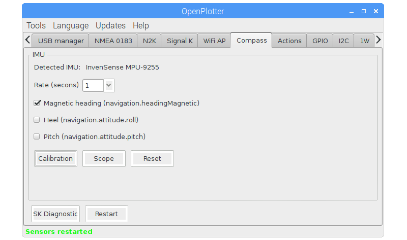
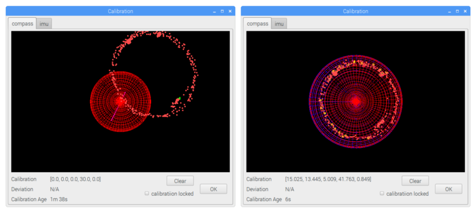

# Compass

---

**This chapter needs to be written/updated/translated**

http://forum.openmarine.net/forumdisplay.php?fid=16

---

Place the IMU on his final position on board and away from possible metallic sources of interference, especially from speakers. After connecting the IMU, it should be detected on _Compass_ tab.

Enable reception of at least one of the 3 possible magnitude and press _Calibration_.

Being moored in port and the boat as more leveled as possible, select the _imu_ tab and press _Boat is level_. After few seconds the 3D boat should be leveled.

Do not close the Calibration window, select the _compass_ tab and go sailing normally. The system will collect data from the IMU during 2 minutes and if there is more than 60 degrees of heading variation and the collected data is valid, it will calibrate the IMU. A blue sphere should appear and the cloud of points should fit the red sphere.

The system will keep re-calibrating all the time every 2 minutes if reception of any of the IMU magnitudes is enabled and it has collected enough valid data. Every 10 minutes calibration and level data are saved to be used on next sesions.