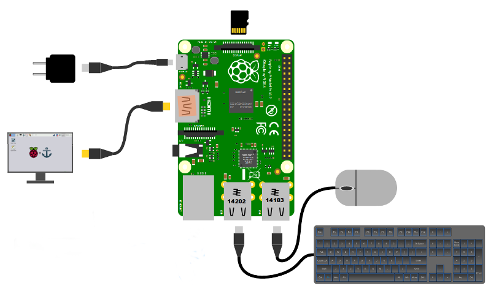
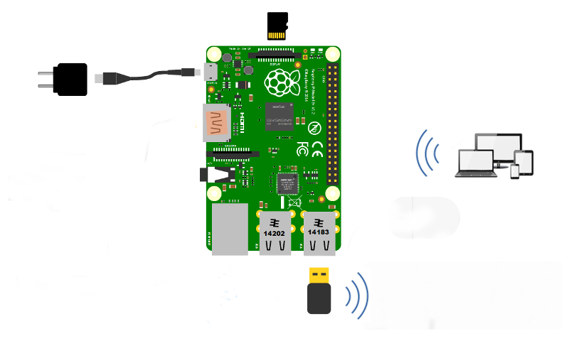

# Welche Dinge benötigst Du?

Es gibt unbedingt notwendige und ein paar zusätzliche Teile. Es hängt davon ab, welche Daten Du sammeln, verarbeiten und darstellen willst und wie Dein Boot bereits ausgestattet ist.

## Benötigte Teile

Zunächst brauchst Du folgende Teil, um _das Programm_ ans Laufen zu bringen, wobei es hier zwei Möglichkeiten gibt: Zum einen den Betrieb mit direkt angeschlossenem **Monitor**, zum anderen den Betrieb ohne Monitor (**headless**).

Wenn Du Hilfe benötigst mit den Basis-Teilen, wirf einen Blick in die offizielle Raspberry Pi Dokumentation[[1]](https://www.raspberrypi.org/learning/hardware-guide/).

### Möglichkeit 1: mit Monitor

* **Raspberry Pi 3** oder Raspberry Pi 2
* **Gehäuse**
* **Netzteil**
* **HDMI Bildschirm**
* **Tastatur und Maus**
* **SD-Karte mit OpenPlotter RPI** (_das Programm_)

### Möglichkeit 2: Headless

* **Raspberry Pi 3** oder Raspberry Pi 2 + WiFi dongle
* **Gehäuse**
* **Netzteil**
* **SD-Karte mit OpenPlotter RPI** (_das Programm_)
* **Ein Laptop, Tablet oder Smartphone**

### Wo bekommst Du diese Sachen?

Du kannst die grundlegenden Teile bei einem offiziellen Distributor[[2]](https://www.raspberrypi.org/products) kaufen oder in einem Raspberry Shop.

Gelegentlich haben wir einige Dinge davon in unserem Shop[[3]](http://shop.sailoog.com).

## optionales Zubehör

Das nächste Kapitel beinhaltet eine Liste der unterstützten Geräte und Sensoren sowie die Kommunikation damit, um Umgebungsdaten zu sammeln.

### Wo bekommst Du diese Dinge?

Gelegentlich haben wir einige Teile in unserem Shop[[3]](http://shop.sailoog.com).

---

[1] https://www.raspberrypi.org/learning/hardware-guide [2] https://www.raspberrypi.org/products [3] http://shop.sailoog.com 
