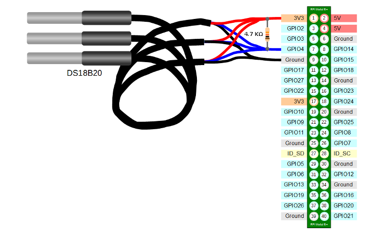

# 1W sensors

---

This chapter is under construction

---

## DS18B20 sensors

### Connection

You have to connect these sensors to GPIO4 and use a pull-up resistor as shown in the image below. You can connect multiple sensors in paralel using just one resistor.

