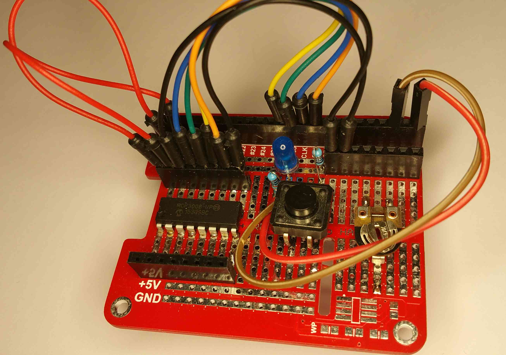
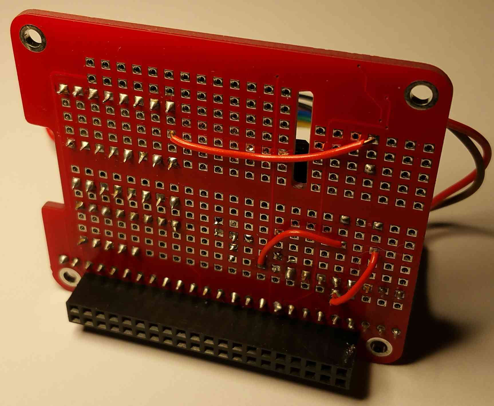
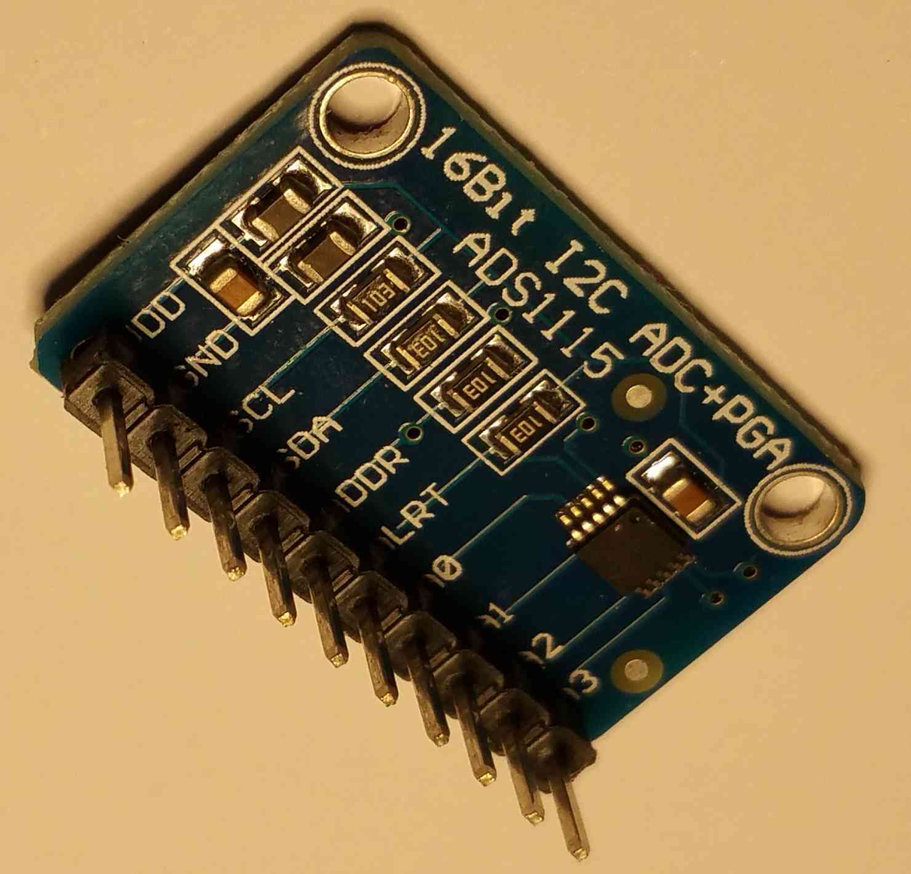
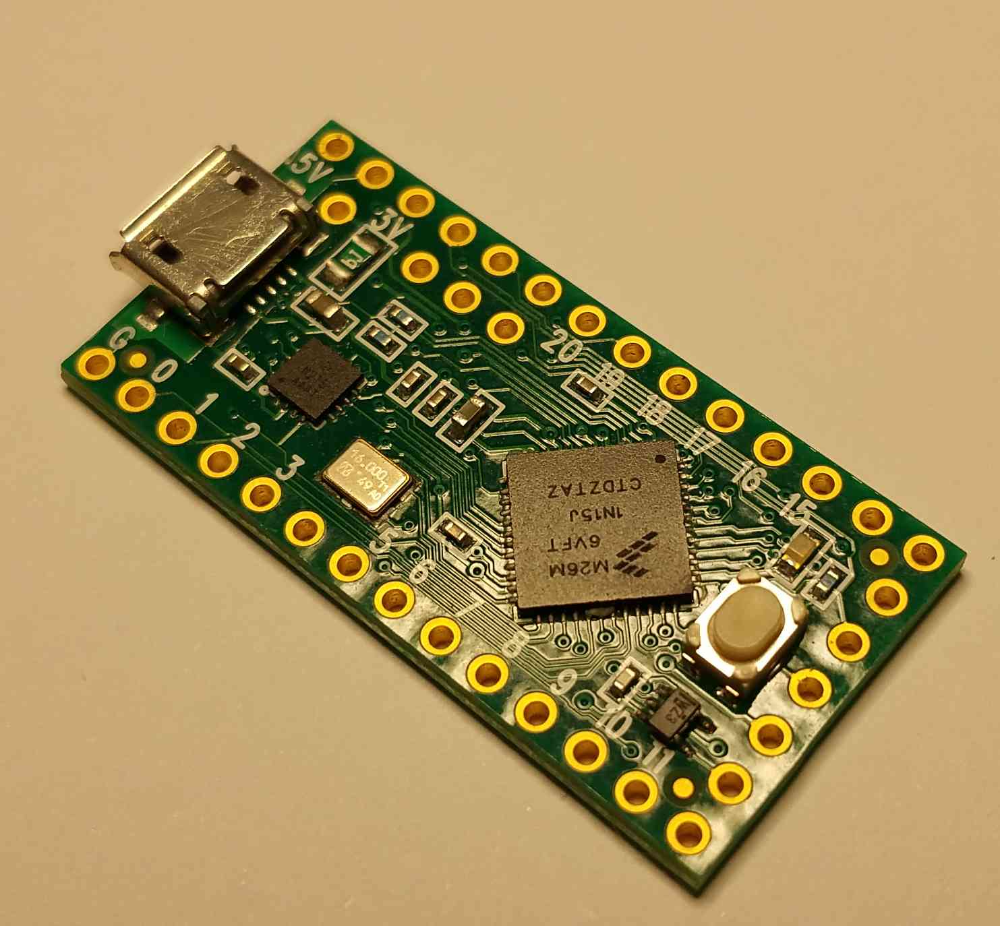

# Analog Digital Converter

### MCP3008

DIY development board front

DIY development board back

### ads1115

has to be connected to I2C bus

### use the adc of the MCU with Firmata protocol

Any Arduino IDE programable board can be used (Picture: Teensy LC) 

