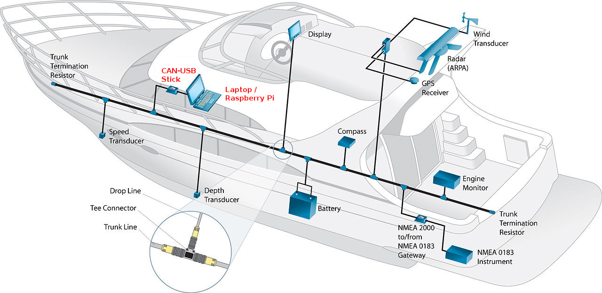
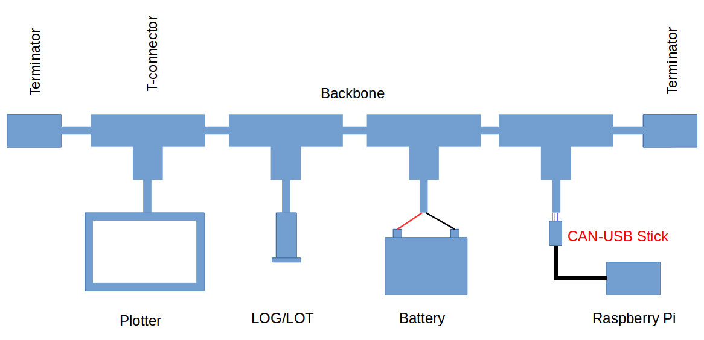
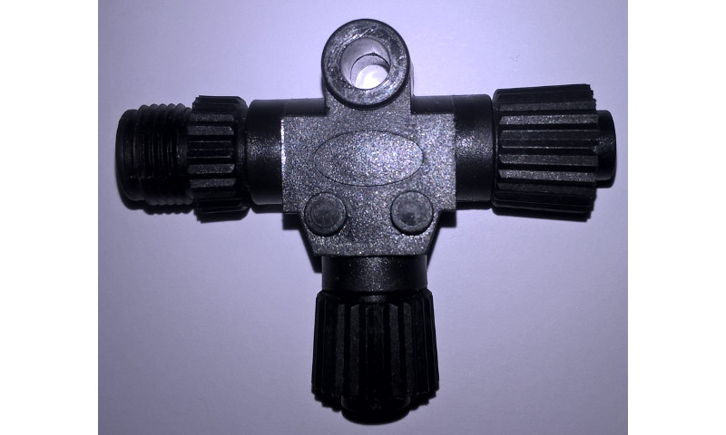
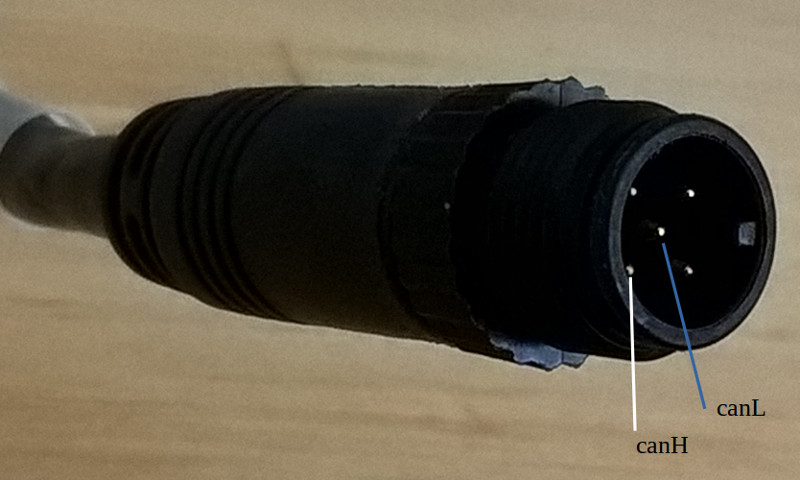
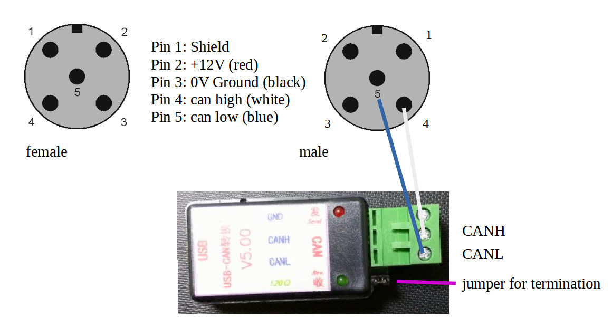
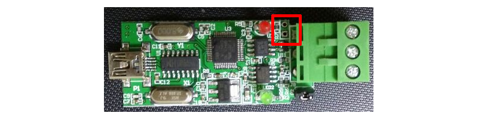

# CAN-USB Stick




---

**You can buy an CAN-USB Stick converter here**

http://www.sailoog.com/shop-category/openplotter

---
## Warning / Disclaimer

The CAN-USB Stick is a research project on data communication in CAN bus and N2K networks on boats.

The software is still under development and has not been fully tested. Malfunctions of the CAN-USB Stick and of any connected device might be possible at any time. Manipulating your N2K network could cause damage to connected devices.

Do not rely on data from this device and do not use as primary source for navigation. Liability cannot be accepted for any damages, personal injuries or malfunctions caused by this device.

The CAN-USB Stick is not certified by NMEA®.

The CAN-USB Stick is not electrically isolated.

It is not allowed to use the Actisense® NMEA Reader software for the CAN-USB Stick.

## Overview

The CAN-USB Stick is based on a stm32F103 micro-controller (MCU) connected to a CAN transceiver and is able to read/write on the CAN bus in a boat network. 

The stick works with a CH340 USB to serial converter. Windows 10 does recognize the serial port (no driver is needed). Linux does also support CH340.

N2K network is described in Wikipedia https://en.wikipedia.org/wiki/NMEA_2000

The program of the MCU has been re-engineered to work together with CANBOAT project (https://github.com/canboat), which is used by Signal K project (http://signalk.org).
Both packets are used in OpenPlotter project.

The stick does also work with OpenSkipper project (http://openskipper.org).

Not tested:

* MacENC (http://macenc.com)
* PolarView NS (http://www.polarnavy.com)

## N2K networks


Example of a small N2K Network

The backbone (or trunk) starts with a 120Ω terminator   and ends with a 120Ω terminator. The two resistors are working in parallel, so the resistance is 120Ω/2=60Ω. If there is a broken connection in the backbone you can measure only 120Ω or nothing but not 60Ω. That is a very easy way to check the bus.


M12 male 120Ω terminator

The drop line to the devices should not be longer than 6 m. The backbone can have 100m in length.

The CAN-USB Stick is not electrically isolated, so connecting the Raspberry Pi/computer power supply to the same CAN bus power supply is recommended.

## Connection

To connect the CAN-USB Stick to the network you need a free T-connector on your backbone and a drop line. The drop line should have a M12 5 pin male connector in one side and 5 wires (but we only need 2) in the other side. The HIRSCHMANN ELST 5012 PG7 connector has a screw terminal.


T-connector


Drop line M12 5 pins male connector side


Drop line wires side


* Pull out the green screw terminal of the stick.
* Connect the drop line blue wire from pin 5 (pin in the middle) to the green terminal on CANL.
* Connect the drop line white wire from pin 4 to the green terminal on CANH.
* Turn off the main power switch to be sure that there is no power on the network.
* Connect the drop line to the free T-connector on your backbone.
* Use a multimeter and measure the resistance between CANH and CANL (on the screws). The resistance should be around 60 Ohm.
* Pull of the jumper for termination from the stick (the network should be already terminated).
* Connect the green screw terminal to the CAN-USB Stick.
* Check again the 60 Ohm between CANH and CANL.
* On the drop line there are three cables left. They have to be isolated.
* Turn on the main power.
* Switch on instrumentation.

To check the N2K traffic on the bus, see the chapter [Signal K](signalk.md).
On other Linux distribution, use the canboat command: ```actisense-serial -r /dev/ttyUSBx ``` (x: use the right device number, typical 0). On Windows use OpenSkipper.

| | Red LED |  Green LED |
| -- | -- | -- |
| Bootsetup (8") | off | off|
| Connected only to computer | flashing every second | on |
| Connected to bus | flashing every second | flashing on traffic |

## Software

The software is still under development and has been built under Eclipse mars1 with the GNU ARM Eclipse Windows Build Tools. The software is licensed under apache 2.

We will publish regular updates. The built .hex file can be flashed into the stick with the “Flash Loader Demonstrator” from ST on Windows (http://www.st.com/web/en/catalog/tools/PF257525).

The board has an unused place for a jumper. Connecting the two holes of the not molded jumper will put the stick into boot loading mode.




## Support

http://forum.openmarine.net/
