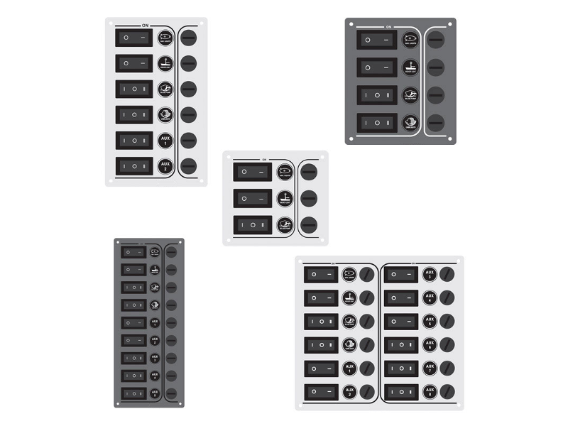

# Common switch

Almost all of the OpenPlotter features have a defined action. You can connect any type of external switch (momentary, toggle...) and assign an action to each state (on/off). So you can shutdown/reset the system, run a custom Linux command, play/stop services, trigger external devices, play/stop audios ...