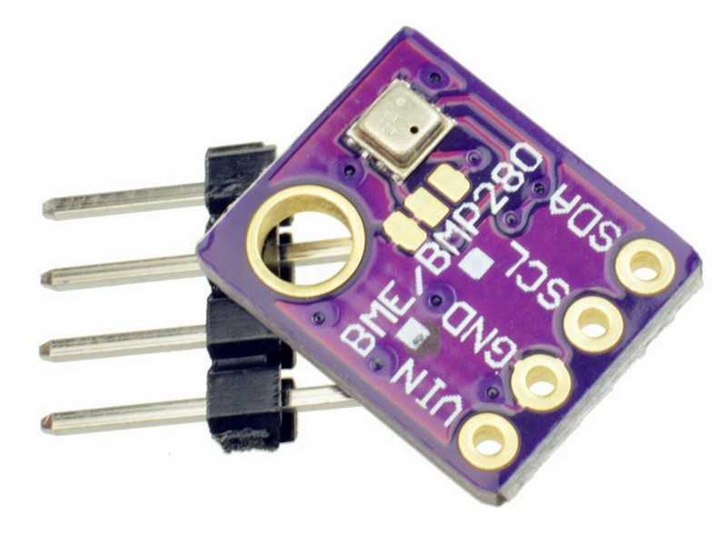

# Environment sensors

Connecting a little environment sensor to OpenPlotter will provide air pressure, temperature or humidity data to monitor weather.

##Supported environment sensors

* BME280 (pressure, temperature, humidity)
* BMP180 (pressure, temperature)
* LPS25H (pressure, temperature)
* MS5611 (pressure, temperature)
* MS5637 (pressure, temperature)
* HTS221 (humidity, temperature)
* HTU21D (humidity, temperature)

## Wiring

Environment sensors have to be connected by I2C interface. See chapter [Wiring I2C sensors](/wiring-i2c-sensors.md).