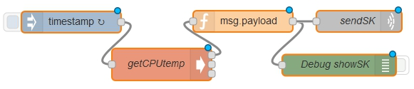
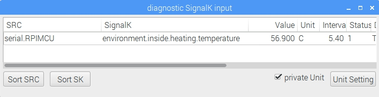

# Frequently Asked Questions

---

**This chapter needs to be written/updated/translated**: http://forum.openmarine.net/forumdisplay.php?fid=16

---

## Signal K

**Q**: How to connect from smartphone to SignalK Instrumentpanel?

**A**: Be sure you are connected to the openplotter access point. Open your browser. Type in 10.10.10.1:3000. Click on Instrumnetpanel. On the right side of the Instrumentpanel is a sign select it to open the menubar. Select _Connect_ and enter in _New SignalK Server_ 10.10.10.1:3000

**Q**: Can I create my own SignalK names?

**A**: You can but it is recommended that you don't (to develop more standard names look for specifications in Github SignalK). If you want to have an overview of already existing SignalK names open the _diagnostic SignalK input_ window and click on _Unit Setting_. If there is a star in the SignalK name you should put in an easy understandable name.

## Node-Red

**Q**: Is there also a chance to send values to the SignalK server of OpenPlotter?

**A**: Yes you can send values to the server when you use the minimum SignalK JSON format. For example:

```json
{
	"updates": [{
			"source": {
				"type": "ARMTEMP",
				"src": "RPIMCU"
			},
			"values": [{
					"path": "environment.inside.heating.temperature",
					"value": "323.15"
				}
			]
		}
	]
}

```
In this example we want to send the RPI cpu temperature to the SignalK Server.





We diidn't find a better SignalK name than environment.inside.heating.temperature.

You can import the code to test it on your own.

```json
[{"id":"f5fa759f.be894","type":"inject","z":"4deb498f.fbcfd8","name":"","topic":"","payload":"","payloadType":"date","repeat":"10","crontab":"","once":true,"x":131,"y":127,"wires":[["adb4b4a8.9c10c8"]]},{"id":"adb4b4a8.9c10c8","type":"exec","z":"4deb498f.fbcfd8","command":"vcgencmd","addpay":false,"append":"measure_temp","useSpawn":"","timer":"","name":"getCPUtemp","x":258,"y":186.5,"wires":[["2705f134.792f86"],[],[]]},{"id":"7b5088a.c5f0af8","type":"debug","z":"4deb498f.fbcfd8","name":"Debug showSK","active":false,"console":"false","complete":"payload","x":507,"y":187.5,"wires":[]},{"id":"2705f134.792f86","type":"function","z":"4deb498f.fbcfd8","name":"msg.payload","func":"cpu_temp = parseFloat(msg.payload.replace(\"temp=\",\"\").replace(\"'C\\n\",\"\"));\ncpu_temp = cpu_temp + 273.15\nmsg.payload = '{\\\"updates\\\": [{\\\"source\\\": {\\\"type\\\": \\\"ARMTEMP\\\",\\\"src\\\" : \\\"RPIMCU\\\"},\\\"values\\\":[{\\\"path\\\": \\\"environment.inside.heating.temperature\\\",\\\"value\\\":'+cpu_temp+'}]}]}\\n';\nreturn msg;","outputs":1,"noerr":0,"x":372,"y":126,"wires":[["7b5088a.c5f0af8","c17f4c75.737088"]]},{"id":"c17f4c75.737088","type":"udp out","z":"4deb498f.fbcfd8","name":"sendSK","addr":"localhost","iface":"","port":"55559","ipv":"udp4","outport":"","base64":false,"multicast":"false","x":535,"y":126,"wires":[]}]
```