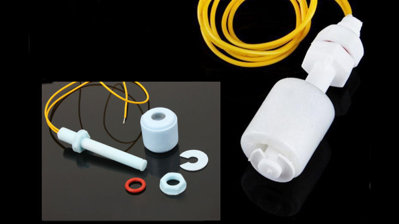

# Float switch

Installing this little magnetic switches on tanks and bilges you will be able to detect when they are full or empty. OpenPlotter may actuate a pump, an indicator, an alarm or warn you by Twitter or email.

---

**Buy a tested Float switch**

http://www.sailoog.com/shop-category/openplotter

---