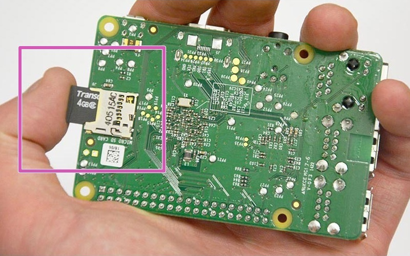
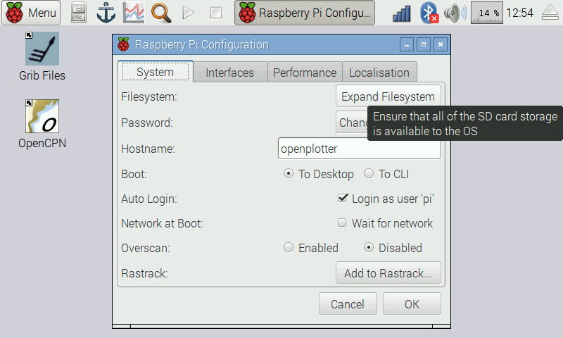

# Getting started

---

This chapter is under construction

---

First of all you have to put together all the [required parts](what_do_you_need.md). If you have trouble with some aspect, try to find help on the [Raspberry Pi official page](https://www.raspberrypi.org/help/). 

Second you have to run the software on your new ARM computer and here you have two options, either buy our plug and play SD card or download and install the software on an SD card.

---

**Buy an 8GB SD card with OpenPlotter RPI ready to run.**

http://www.sailoog.com/shop-category/openplotter

---

## Installing OpenPlotter RPI on an SD card

Download the last version of **OpenPlotter RPI** from 

http://sailoog.com/blog-categories/openplotter-rpi

It is a compressed file and weighs just over 1GB so it will take a little.

Once the download is complete we will have to unzip it and at the end we will have an .img file of about 4GB to be recorded on an SD card.

OpenPlotter RPI is built from Raspbian operating system and therefore the way to pass it to an SD card is the same as for that system. On these links are the instructions to do so depending on which system we are using to perform the process.

Linux: https://www.raspberrypi.org/documentation/installation/installing-images/linux.md

MAC: https://www.raspberrypi.org/documentation/installation/installing-images/mac.md

Windows: https://www.raspberrypi.org/documentation/installation/installing-images/windows.md

## First boot

If you want to build a headless system see the next chapter [Headless](headless.md) before reading further.

Once we have created our SD card with OpenPlotter RPI, we will insert it into our Raspberry Pi.

Turn the Raspberry on and go to *Menu* > *Preferences* and select *Raspberry Pi Configuration*.

*screenshot*

A window will open and we have to click on *Expand Filesystem*. Doing this, the next time you reboot, the system will use the full capacity of the SD card.

## Setting language

*text*

*screenshot*

## Ok, now what?

Congratulations! You have your system running so it is time to start getting some data from the world. The most common and logic step it would be connecting a GPS through the [NMEA 0183 multiplexer](nmea_multiplexer.md).