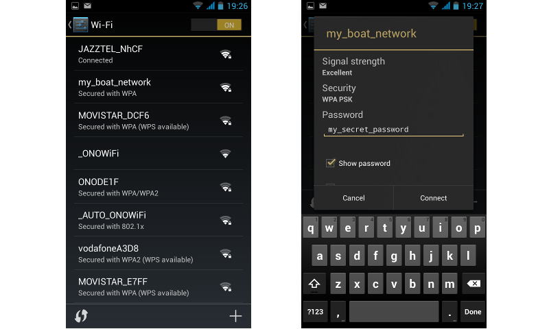
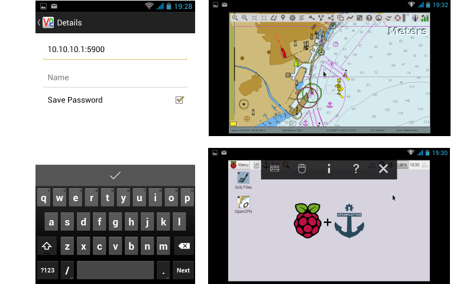

# Headless

You can use the RPI in headless mode after the noobs installation is done.

There are two ways to work headless.

1. Over wifi \(You have to setup a wifi access point \(hotspot\) [WiFi access point](/wifi-access-point.md).

2. You can connect to the RPI by an Ethernet cable and use the bonjour protocol or the bridged hotspot.


Once we have created the SD card with noobs, we have to insert it into any computer with any OS \(Linux, MAC, Windows\). The mounted device should be called _boot_ and there should be a file called _config.txt_. Open this file in a text editor like notepad on windows, but not anything like MS Word which can save it as something which is not just plain text.

The top lines should look like this:

```
[OPENPLOTTER]

#HEADLESS

# uncomment to enable WiFi access point. Default=0
#wifi_enable=0
# uncomment to set WiFi access point. wlan0, wlan1, wlan2 ... default=wlan0
#device=wlan0
# uncomment to set WiFi access point. SSID must have a maximum of 32 characters, default=OpenPlotter
#ssid=OpenPlotter
# uncomment to set WiFi access point. Password must have a minimum of 8 characters, default=12345678
#pass=12345678
# uncomment to set WiFi access point. b=IEEE 802.11b, g=IEEE 802.11g, defaul=g
#hw_mode=g
# uncomment to set WiFi access point. 1 to 11, default=6
#channel=6
# uncomment to set WiFi access point. 1=WPA, 2=WPA2, 3=both, default=2
#wpa=2
# uncomment to select device connected to Internet and share connection. wlan0, wlan1, wlan2 ... default=0
#share=0
# uncomment to enable bridge to eth0. Default=0
#bridge=0
# uncomment to set the access point IP. Default=10.10.10.1
#ip=0

# uncomment to force screen resolution (only VNC remote desktop)
#framebuffer_width=800
#framebuffer_height=600

...
```

If you are going to connect to OpenPlotter by VNC remote desktop, you have to remove the \# character from words  _**framebuffer\_width**_ and _**framebuffer\_height**_ and set the screen size \(800x600 by default\).

If you are going to connect to OpenPlotter by RDP remote desktop, you do not have to remove the \# characters from words _framebuffer\_width_ and _framebuffer\_height_, you will set the screen size from RDP software. See more information in [Remote desktop](remote_desktop.md) chapter.

To create the WiFi hotspot you have to remove the \# character from words _**device**_, _**ssid**_ and _**pass**_.

If only one WiFi dongle is connected, the _device_ value should always be _wlan0_ but if more than one is connected, the _device_ value could be _wlan0_, _wlan1_ ...

_ssid_ will be the name of your WiFi network. Use any character but a maximun of 32.

_pass_ will be the password of your WiFi network. Use any character but a minimum of 8.

Save and eject the SD card, then insert it into the Raspberry Pi. Make sure the WiFi dongle is also inserted and power up the Pi.

After it has finished booting up, there should be a new WiFi network called _OpenPlotter_ available. Log onto this network using the password _my\_secret\_password_.



Finally, open your favourite VNC remote desktop client on your laptop, tablet or smartphone and make a new connection with the address/port combination: **10.10.10.1:5900**, or just the address **10.10.10.1** if you are using a RDP remote desktop client.

Connect and enjoy!



See more information about tested remote desktop software in [Remote desktop](remote_desktop.md) chapter.

If this is your first boot, go to [Getting Started](getting_started.md) chapter and follow the steps.

