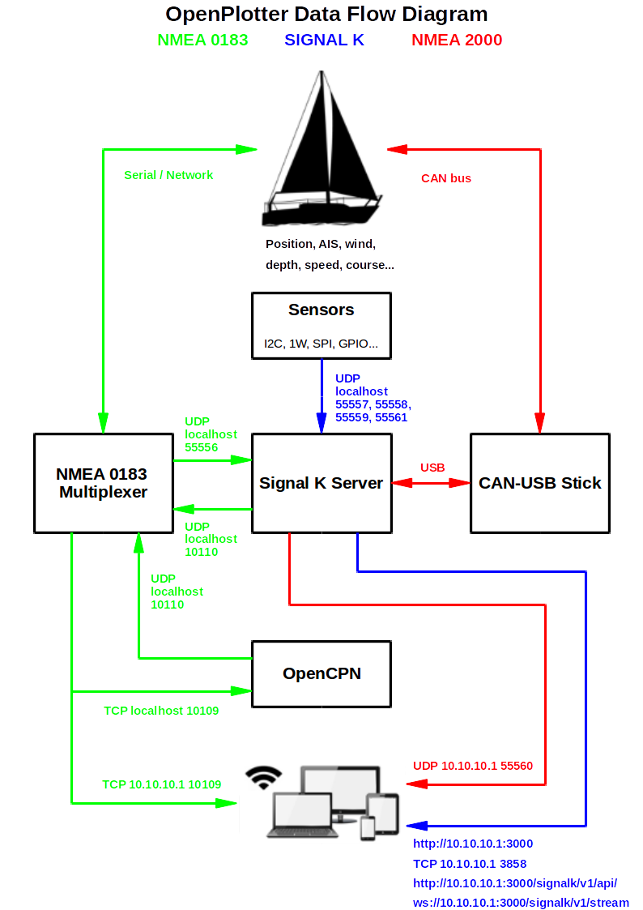

# How does it work?

---

**This chapter needs to be written/updated/translated**

http://forum.openmarine.net/forumdisplay.php?fid=16

---

OpenPlotter can collect/serve data from/to different devices:

* Analog and digital sensors connected to GPIO port.
* Serial and other devices connected to USB port.
* Any computer or portable device connected to the same network.

## Inputs

Most of these sources directly send data in the maritime formats called NMEA 0183 or NMEA 2000. The problem is that NMEA 0183 can not communicate with NMEA 2000 and there are non-strictly maritime data that are not defined in the NMEA schemas.

We use the free maritime communication Signal K schema to connect both NMEA formats. Other devices like SDR AIS, analog and digital sensors, switches.. are processed by OpenPlotter to convert raw data into Signal K too. Signal K has been the OpenPlotter base protocol since v0.9.x.

## Outputs

Once we have all data stored in Signal K schema, we can convert data into both NMEA formats, process data to generate new Signal K data or set conditions to trigger defined actions. We can also server directly Signal K data to the connected devices.

## Uses

Different pieces of software and hardware need different data streams.

The good old NMEA 0183 is a readable serial protocol used for:

* Most current PC, tablets and mobile software. 
* The internal chartplotter, OpenCPN.
* With OpenPlotter tools, we can build obsolete, non-standard, proprietary and missing NMEA 0183 sentences from Signal K.

NMEA 2000 is special CAN-BUS protocol. It's advantage is the data security. It is popular in the automotive industrie. NMEA 2000, is used for:

* Most modern boats \(plotter, engine...\).
* Very little software.

The browsers optimized protocol Signal K is used for:

* Future software.
* Virtual instrument panels.
* It has an open and readable protocol where additions can be done.

The non-strictly maritime datastream is used for:

* Security.
* Alarms.
* Energy savings.
* Remote automation.
* ...

Picture: another data flow example 

