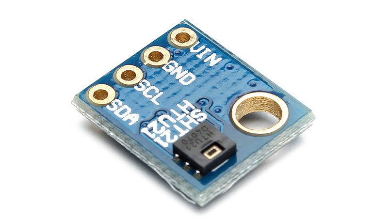

# Humidity/Temperature sensor

Connecting a humidity sensor to OpenPlotter will provide air relative humidity data to build graphs and monitor weather.

Often, humidity and temperature sensors are on the same board.

If you have another board like a pressure sensor which has a temperature sensor too, you will be able to select which one you prefer.

Humidity/Temperature sensors have to be connected by I2C interface.

##Supported humidity/temperature sensors

* HTS221
* HTU21D

---

**Buy a tested HTU21D sensor**

http://www.sailoog.com/shop-category/openplotter

---