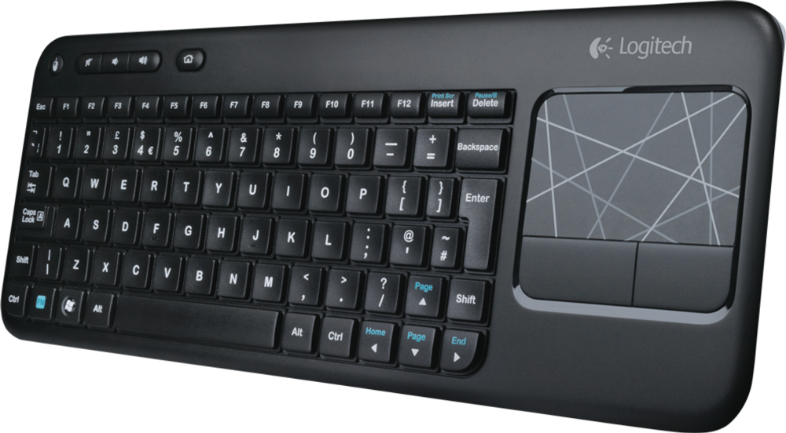

# Keyboard and mouse

Any standard USB keyboard and mouse will work with your Raspberry Pi. Wireless keyboard & mouse combos are a good option.

You will not need neither keyboard nor mouse if you are using OpenPlotter by remote desktop.