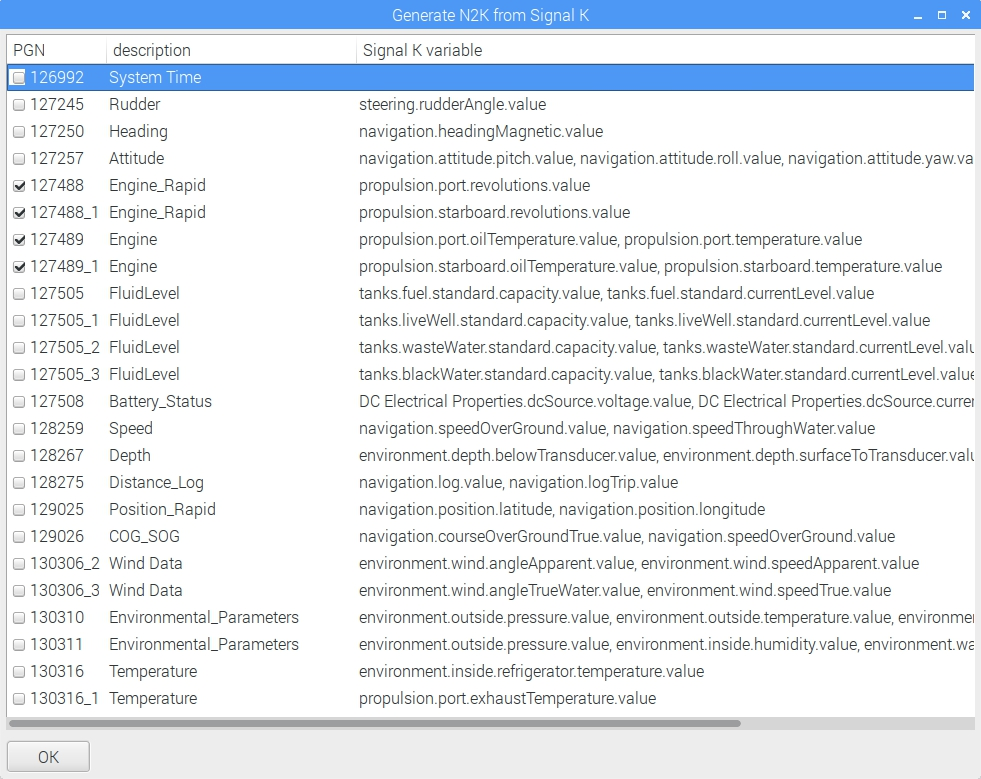

# NMEA 2K

Settings

* select the N2K port
* activate Enable N2K input
* activate Enable N2K output

# Diagnostic input

If buttom is gray, you have to deactivate Enable N2K input

# Diagnostic output

If buttom is gray, you have to deactivate Enable N2K output

# Output settings

If buttom is gray, you have to deactivate Enable N2K input and Enable N2K output

After opening the dialog box press two times check to read the settings from the CAN-BUS adapter.

First step is to enable needed PGNs for output. Then press apply and press check. Check if settings are done.

# NMEA 2000 generator

Tools-&gt;NMEA 2000 generator

Check the PGNs you want to send onto the NMEA 2000 bus \(it only works if the output settings for the PGNs are also set\).

