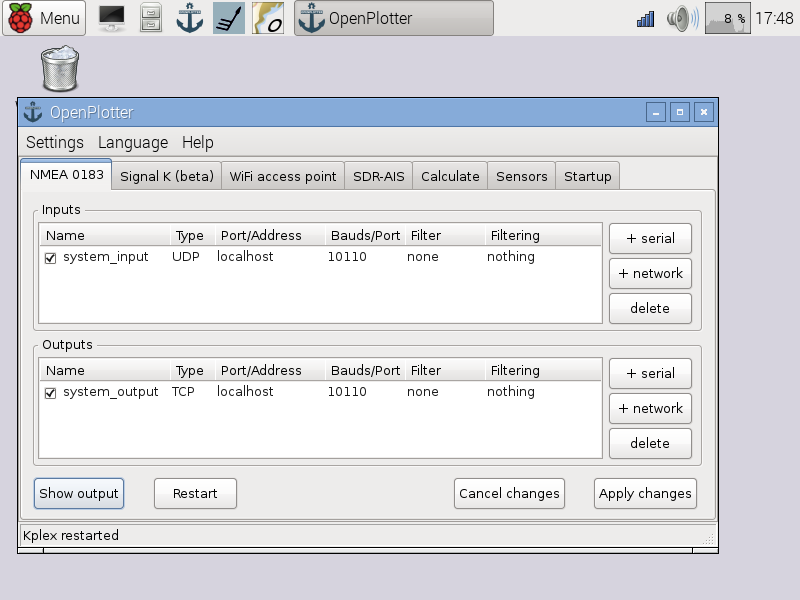
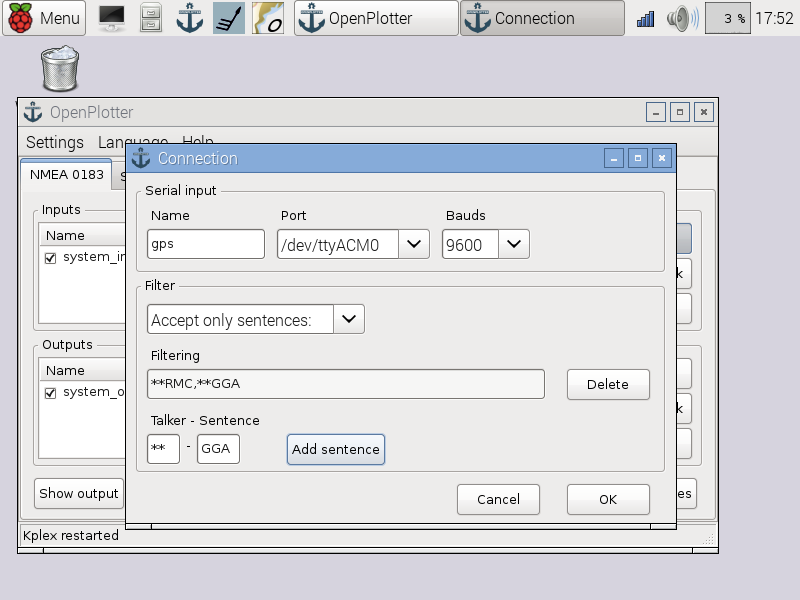
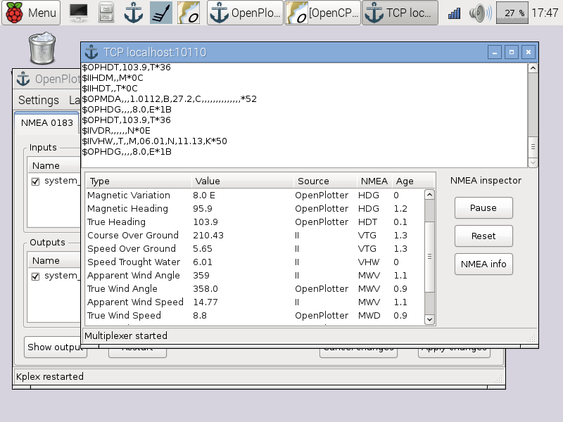

# NMEA 0183 Multiplexer

## System defaults

All the data generated by OpenPlotter ([Sensors](sensors.md), [SDR AIS](sdr_ais.md), [Calculations](calculate.md)...) will be automatically sent to *system input* (UDP localhost 10110) in the NMEA 0183 Multiplexer.

All the inputs will be automatically multiplexed and available at the *system output* (TCP localhost 10110). You have just to configure OpenCPN to listen to *system output* (TCP localhost 10110) to get all the data.

## New connections

Under construction

## NMEA 0183 Inspector

Under construction

