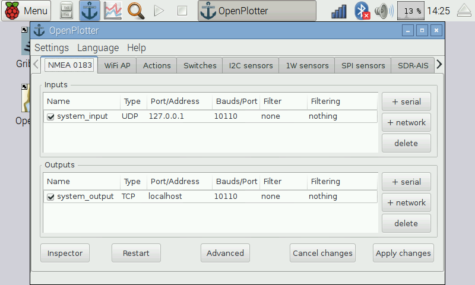

# NMEA 0183 Multiplexer

It is important that you understand that OpenPlotter must drive all the NMEA data traffic to work properly, so you do not need to configure OpenCPN to get GPS signal, we will set this in OpenPlotter NMEA 0183 tab.

## System defaults

All the NMEA data generated by OpenPlotter such as these from sensors, SDR AIS or calculation, will be automatically sent to the ***system input*** type UDP, address 127.0.0.1 and port 10110.

If you want to connect a GPS USB dongle or get data from the boat through a NMEA 0183 to USB converter, you have to create a serial input. If you want to get data from any device connected to the same network than OpenPlotter, you have to create a network input.

All the inputs will be automatically merged (multiplexed) and will be available at the ***system output*** type TCP, address 127.0.0.1 and port 10110. You have just to create a TCP network input in OpenCPN to listen to address 127.0.0.1 and port 10110 to get all the multiplexed NMEA data.

Even if you have only one NMEA source, as for example just a GPS, you should create the serial input in OpenPlotter and get the data from the *system output*. Doing this, GPS data will be available for other applications.

You can not disable nor delete *system input* and *system output*.

Kplex is the application that handles the multiplexing. For special cases, click on the *Advanced* button to edit the Kplex configuration file.