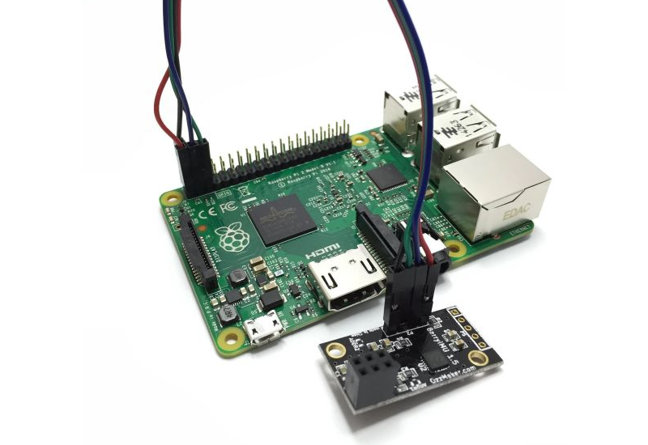

# Optional
##Self powered USB Hub

If you are connecting devices which use more power than your Raspberry can provide, you will need a self powered USB Hub.

It would be a good idea to get a Hub with 5V input so that you could power it with the same source as your raspberry.

###Buy a tested USB Hub.
Cheap 7 ports USB 2.0 self powered Hub.

http://www.sailoog.com/en/xxxxxxxxxx

##USB WiFi dongle

You will need an USB WiFi dongle if you want to connect either OpenPlotter to internet or your mobile devices on board to OpenPlotter.

A WiFi adapter will probably need more power than the Raspberry Pi USB port can provide, especially if there is a large distance from the WiFi adapter to the WiFi Access Point, or it is transferring large amounts of data. Therefore, you may need to plug the WiFi adapter into a powered USB hub.

###WiFi access point

To share data with on board devices by WiFi you have to set OpenPlotter as an access point and connect devices to it. However not all WiFi dongles can function as an access point, only devices with the **RTL8192CU** or **RTL8188CUS** chipset will work.

##USB GPS dongle

If you don't have any GPS on board or you want an extra positioning device, this is the cheapest way.

Connecting an USB GPS dongle to OpenPlotter will provide accurate position, date/time and speed/course over ground.

###Buy a tested GPS/GLONASS USB dongle.

Low-power, GPS/GLONASS compatible, NMEA-0183 output.

http://www.sailoog.com/en/xxxxxxxxxx

##USB RS422/RS232 converter dongle

If you have sensors and electronics with NMEA-0183 outputs on board you will need an USB converter to connect it to OpenPlotter. Additionally, you will be able to talk to electronics with NMEA-0183 inputs.

The NMEA-0183 hardware standard uses RS422 connectors but you may find some devices with RS232 as well. 

###Buy a tested USB RS422/RS232 bi-directional converter.

Select your right connector.

http://www.sailoog.com/en/xxxxxxxxxx

http://www.sailoog.com/en/xxxxxxxxxx

##USB DVB-T dongle (AIS reception)

DVB-T dongles based on the Realtek RTL2832U chip can be used as a cheap one channel AIS receptors.

A DVB-T dongle will need more power than the Raspberry Pi USB port can provide. You need to plug the dongle into a powered USB hub.

###Antenna

Any VHF antenna will work right. Some homemade antennas:

http://sdrformariners.blogspot.com.es/p/blog-page.html

http://nmearouter.com/docs/ais/aerial.html

https://www.youtube.com/watch?v=SdEglNHyHB4

##IMU sensor

If you don't have a electronic compass on board you will need an IMU.

An Inertial Measurement Unit, or IMU, measures and reports on velocity, orientation and gravitational forces, using a combination of an accelerometer, gyroscope, and a magnetometer. Some IMUs are also fitted with a barometric sensor and a temperature sensor.

Connecting an IMU to OpenPlotter will provide magnetic heading which is needed to calculate true heading and true wind. Besides, if barometric and temperature sensors are included, you will get graphs to monitor the weather.