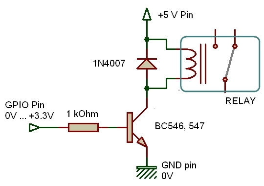

# Outputs

## General
Outputs are driven through the GPIO (General Purpose Input/Output) pins. These pins are copper connected to the CPU chip. A short circuit with 0V or +3.3V is not final, but any direct contact with the + 5v (or higher) can KILL the Raspberry Pi... 
The output have to be activated in OpenPlotter related panel. 
## LED output

Ignoring the Pi for a moment, one of the simplest electrical circuits that you can build is a battery connected to a light source and a switch (the resistor is there to (limit the current flow) and protect the LED):

When we use a GPIO pin as an output, the Raspberry Pi replaces both the switch and the battery in the above diagram. Each pin can turn on or off,or go **HIGH** or **LOW** in computing terms. When the pin is **HIGH** it outputs** 3.3 volts** (3v3); when the pin is LOW it is off.

Here's the same circuit using the Raspberry Pi. The LED is connected to a GPIO pin (which can output +3v3) and a ground pin which is 0v and acts like the negative terminal of the battery :
 (the resistor is there to limit the current flow and protect both the LED and the Raspberry CPU). A value of 1 kOhm will retrain the current around 1.5 mA

 

## Relay
The GPIO pins can only deliver a few mA, and cannot drive directly a relay. Therefore a few electronics components are required : 

* The NPN transistor BC54x acts as a valve to control the current through the relay coil (switching mode) : it is either passing when GPIO is HIGH, or blocked when GPIO is LOW. Its maximum current is 100 mA ;
* The 1 kOhm resistor limits the current drawn from the GPIO pin below 3 mA ; 
* The diode, 1N4007 prevents damaging the transistor (and/or GPIO pins !) when the relay is commuted. 
* The relay is a 5VDC relay, with an internal resistance of 60 Ohm. It requires less than 90mA compatible with the transistor. (e.g. printed circuit relay Omron G5RL-1-E-HR 5 VDC 5 V/DC 16 A ). 

Relays used in automobile industry should be connected to + 12 VDC. They will draw a higher current (4 to 500 mA), and call for a more elaborated design (cascading two transistors). 

