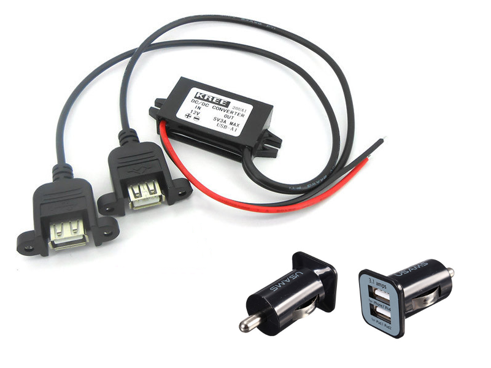

# Power supply and cable

The Raspberry Pi is powered by a 5V USB power supply with a micro USB connector (like most standard mobile phone chargers). Exactly how much current (Amp) the Raspberry Pi requires is dependent on what you connect to it. A 1.2A (1200mA) power supply from a reputable retailer will provide you with ample power to run your Raspberry Pi for most applications, though you may want to get a 2.5A (2500mA) if you want to use all 4 USB ports without using an external powered USB hub.

If you need to connect USB devices that will take the power requirements above 1.2 Amp, then you must connect them to an externally-powered USB Hub.

It would be a good idea to get an USB car charger adapter (12v to 5V) with two outputs in case you need to power an USB Hub too. We recommend a power supply capable of providing a minimum of 3A.

---

Buy a tested USB Power supply.

http://www.sailoog.com/shop-category/openplotter

---