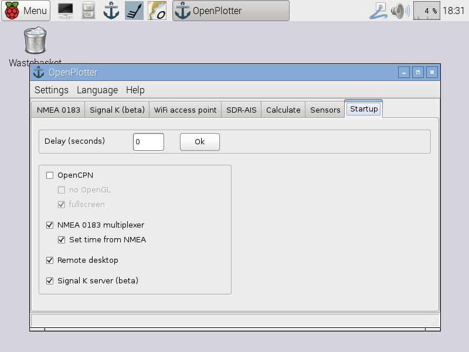
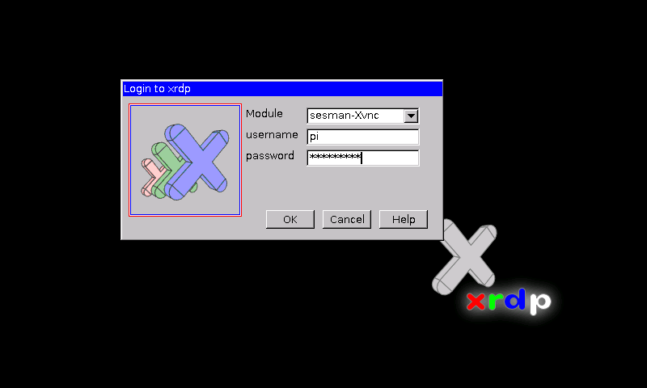

# Remote desktop
---

This chapter is under construction

---

If you want to use OpenPlotter from external devices (laptops, tablets or smartphones) by remote desktop, all of them have to be connected to the same network and you have to know what IP has been assigned to OpenPlotter.

You can set OpenPlotter as WiFi access point and connect your devices to him. In this case your IP will be always **10.10.10.1**.

You can also connect OpenPlotter to any access point or router and connect your remote devices to this point too. In this case you have to find out what IP has been assigned to OpenPlotter by the router.

You have to install a remote desktop client on your remote device. There are two types, VNC and RDP, and some applications can use both of them.

VNC replicates the current desktop in OpenPlotter and RDP creates a new one with different resolution if you want. RDP is faster than VNC.  

##VNC

Be sure the checkbox *VNC remote desktop* is enabled in the *Startup* tab.

To connect by VNC you have to provide the IP of OpenPlotter and the port 5900.

### Tested VNC remote desktop clients

**Linux**

Vinagre.

**Windows**

RealVNC Viewer, TightVNC.

**MAC**

**Android**

bVNC, RealVNC Viewer, VNC per Android.

**IOS**

RealVNC.

##RDP

To connect by RDP you have to provide just the IP and the password of user "pi" of OpenPlotter. If you have not changed it, it should be "raspberry".

### Tested RDP remote desktop clients

**Linux**

Vinagre.

**Windows**

Windows 10 Remote Desktop Client, Windows CE 5.0 Remote Desktop Client.

**MAC**

**Android**

Remote RDP Lite, RDC, Remote Desktop Client, aRDP, RDP Remote Desktop

**IOS**

