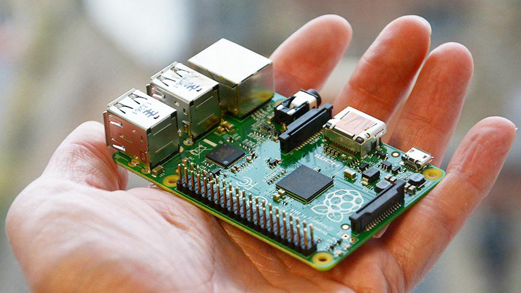

# Required

##ARM embedded computer
We recommend the popular [Raspberry Pi 2 Model B](https://www.raspberrypi.org/products/raspberry-pi-2-model-b/) because it fits the requeriments: low-cost, low-consumption and has a huge community of developers.

**OpenPlotter RPI**,  the operative system for Raspberry Pi and OpenPlotter is ready!

##Box
##Power supply
##HDMI/DVI/VGA/TV monitor and cable
##Keyboard and mouse
##SD card
##OpenPlotter RPI "the software"