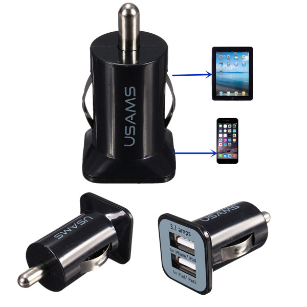
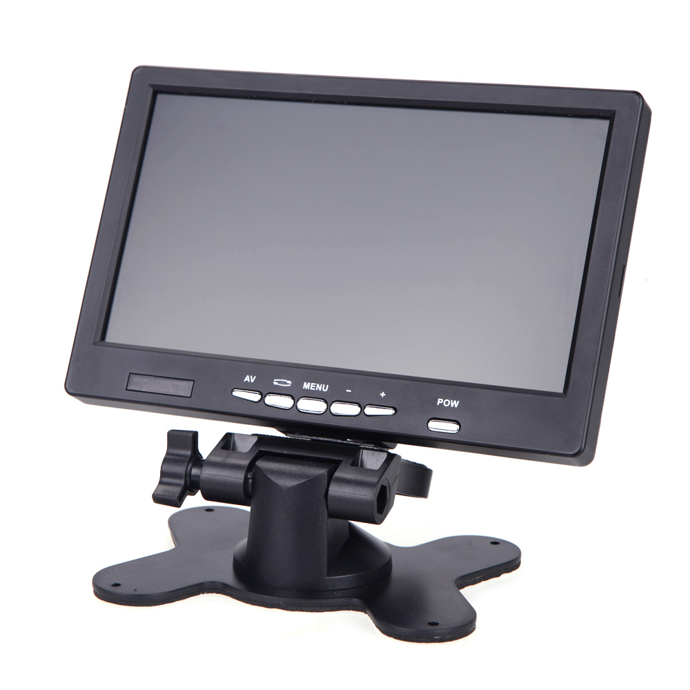

# Required

##ARM embedded computer

We recommend the popular [Raspberry Pi 2 Model B](https://www.raspberrypi.org/products/raspberry-pi-2-model-b/) because it fits the requeriments: low-cost, low-consumption and has a huge community of developers.

**OpenPlotter RPI**,  the operative system for Raspberry Pi and OpenPlotter is ready!

##Box

There are a lot of models to protect the Raspberry Pi board. 
We are working in a water resistant enclosure.

##Power supply and cable

The Pi is powered by a 5V USB power supply with a micro USB connector (like most standard mobile phone chargers). Exactly how much current (mA) the Raspberry Pi requires is dependent on what you connect to it. The maximum power the Raspberry Pi can use is 1 Amp. If you need to connect a USB device that will take the power requirements above 1 Amp, then you must connect it to an externally-powered USB HUB.

It would be a good idea to get an USB car charger adapter (12v to 5V, 3.1A) with two outputs in case you need to power an USB HUB too.

##HDMI/DVI/VGA/TV monitor and cable

The Raspberry Pi has a HDMI port which you can plug directly into a monitor or TV with an HDMI cable. This is the easiest solution; some modern monitors and TVs have HDMI ports, and some do not, but there are other options:

**DVI**

For monitors with a DVI port, you can use an HDMI-to-DVI cable.

**VGA**

For monitors with VGA only, you can use an HDMI-to-VGA adapter. We suggest using only powered HDMI-to-VGA adapters (with an external power source).

**Composite Port**

For analogue TVs you can use  a 3.5mm composite video/audio lead.

##Keyboard and mouse
##SD card
##OpenPlotter RPI "the software"