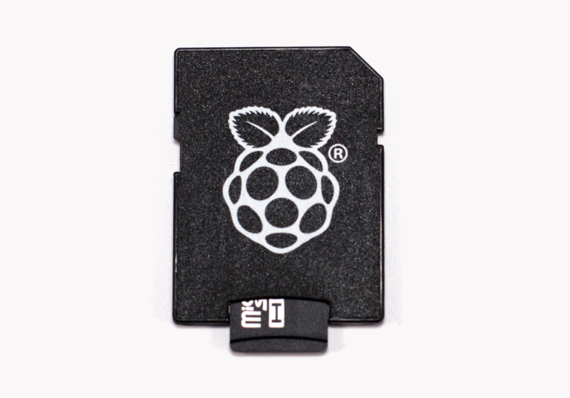

# SD card

You need an SD card to work as the hard disk of your system and where you will install the operating system.

The Raspberry Pi 2 should work with any micro-SD-compatible card, although there are some guidelines that should be followed:

A minimum of 4GB is required but 8GB is recommended.

The card class determines the sustained write speed for the card; a class 4 card will be able to write at 4MB/s, whereas a class 10 should be able to attain 10 MB/s. However it should be noted that this does not mean a class 10 card will outperform a class 4 card for general usage, because often this write speed is achieved at the cost of read speed and increased seek times.

---

**Buy our plug and play SD card with OpenPlotter RPI ready to run**

http://www.sailoog.com/shop-category/openplotter

---