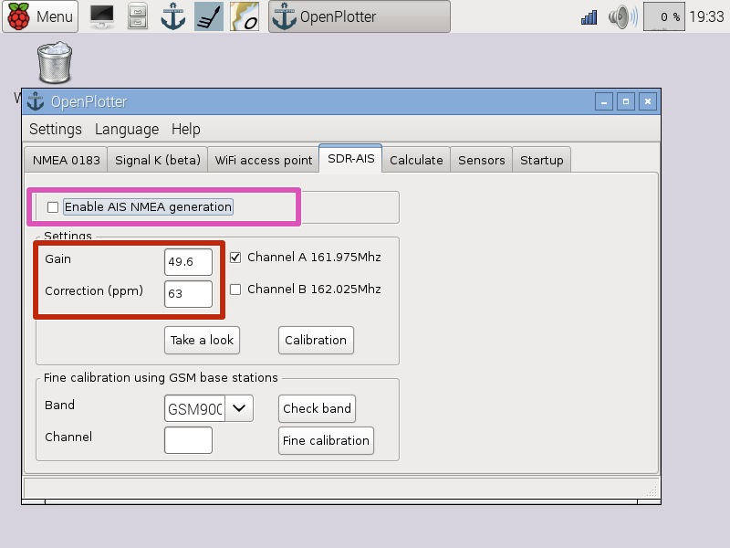
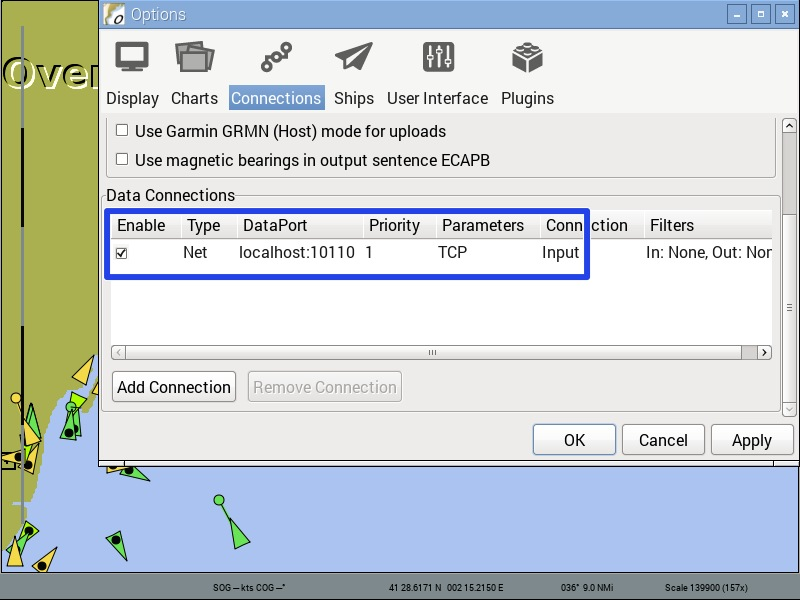

# DVB-T dongle (AIS)

---

This chapter is under construction

---

DVB-T dongles based on the Realtek RTL2832U chip and the new R820T2 tuner can work as a SDR AIS receiver. 

A DVB-T dongle will need more power than the Raspberry Pi USB port can provide. You need to plug the dongle into a powered USB hub. Connecting and disconnecting can draw too much power and cause malfunction, try to do it when the system is off.

OpenPlotter is ready to get SDR AIS signal out of the box, you just have to calibrate to find **gain** and correction (**ppm**) values.

You can buy our DVB-T dongle and we can calibrate it for you and include a note with the gain and ppm values:

http://www.sailoog.com/shop-category/openplotter

or you can follow this detailed guide:

http://sailoog.dozuki.com/Guide/Connecting+and+calibrating+SDR-AIS+dongles/3

## Receiving

Once you have found your **gain** and **ppm** value (in red), select ***Enable AIS NMEA generation*** (in pink).

If you have AIS traffic around, AIS NMEA data will be decoded and sent to **system input UDP localhost 10110** (in orange).

If you want to have access to AIS data you will have to connect your software (OpenCPN) to **system output TCP localhost 10110** (in yellow).

Press **Restart** (in red) to be sure the multiplexer is working.

Press **Show output** (in pink) to see AIS data in the NMEA Inspector.

Be sure OpenCPN is listening to **TCP localhost 10110** (in yellow).

**You do not need to enable the rtlsdr plugin in OpenCPN**. If you want to use that plugin you must disable SDR AIS reception in OpenPlotter.

## Antenna

Although you can get to receive some boat with the supplied mini antenna, it is not enough for optimal reception of AIS frequencies. Any VHF antenna with the appropriate connector adapter will work fine. The antenna connector type of the dongle is female MCX.

Some home-made antennas:

http://sdrformariners.blogspot.com.es/p/blog-page.html

http://nmearouter.com/docs/ais/aerial.html

https://www.youtube.com/watch?v=SdEglNHyHB4
