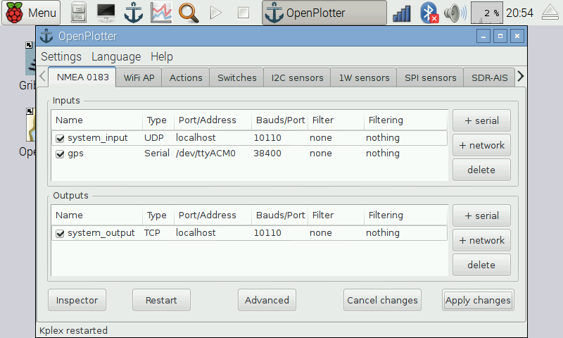

# Software

**OpenPlotter RPI** is a modified version of [Raspbian](https://www.raspbian.org/), the official operating system for the Raspberry Pi. It contains all you need.

OpenPlotter RPI is open-source and free. Download and follow the instructions.

---

**Download**

http://www.sailoog.com/en/blog-categories/openplotter-rpi

---