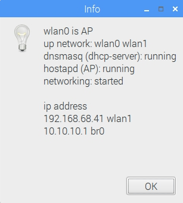
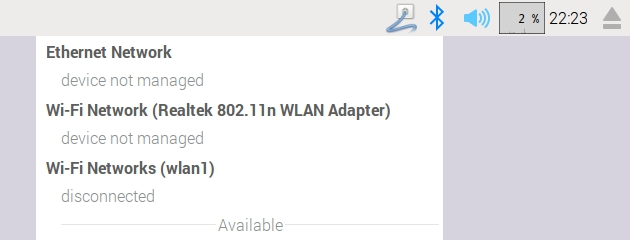

# WiFi AP

Picture: RPI active as AP with bridge to the ethernet port. The internet connection comes over wlan1

If **Enable access point** is selected the AP should be active. To change settings you have to disable AP mode. **But be careful you will lose the connection to the RPI if you work headless.**

As **Access point device** you can only select AP mode able wlan \(There were many changes in the RPI firmware and drivers only few wlan sticks work together. Sometimes if you add a non AP mode stick the AP mode for both is blocked.\)

The second wlan is for connections to the internet \(seaport wifi or mobile phone AP\). If you do it this way all tablets mobile phones PCs haven't got to change the wlan when reaching a seaport. If the RPI has a connection to the internet \(seaport wifi\) all connected devices have internet access.

Sharing Internet can also be done by connecting to an internet router by ethernet port. There is also a chances to connect to the internet with an gsm stick.\(but it is easier to use mobile phone internet sharing over wifi\)

The ethernet port can be bridged to the AP to act like a normal router. This is important if you have a plotter with ethernet port. Then the RPI acts like a gofree router.

When pressing the **Status** button

this window pops up and shows the network status.

### RPI network manager

In the original RPI network-manager some devices show up as _device not managed_.

These devices are managed by OpenPlotter (in this example wlan0 is AP and bridge to eth0 is enabled).

In this example wlan1 can be managed by network-manager to connect to the internet.

If you use remote desktop and want to connect to the internet by using the network-manager select **console**. Then you can connect to the internet otherwise linux security system blocks some settings.

