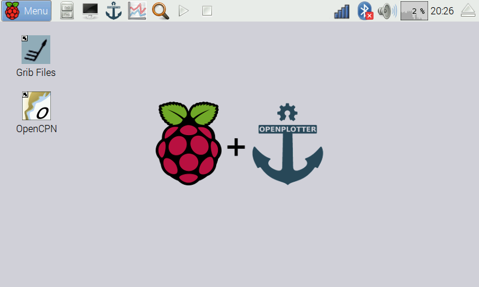

# What is OpenPlotter?

Hay gente que compra barcos pero también hay personas que los construyen, ¿por qué no construirte tu própia electrónica también? Openplotter es una combinación de software y hardware para ser usado como ayuda a la navegación en barcos de pequeña y mediana eslora. Es también un sistema completo, no profesional, de automatización a bordo. Funciona en ordenadores ARM como la [Raspberry Pi](https://www.raspberrypi.org/) y es de código abierto, bajo coste y bajo consumo. Su diseño es modular, así que solo tienes que incorporar lo que tu barco necesite. Hazlo por tí mismo.

## Características

* **Trazador Gráfico**. Con [OpenCPN](http://opencpn.org), un programa de navegación con útiles plugins.
* **Predicciones Metereológicas**. Descarga y visualiza ficheros GRIB mediante [zyGrib](http://www.zygrib.org).
* **Multiplexor NMEA 0183**. Combina y filtra datos procedentes de cualquier número de medios en serie o en red.  Envía y filtra a cualquier número de salidas.
* **Señal K (beta)**. OpenPlotter está preparado para [Signal K](http://signalk.org/),el nuevo, gratuito y de código abierto formato de intercambio de datos marinos.
* **Inspector**. Comprueba el tráfico de datos para evitar conflictos y solapamientos entre dos fuentes.
* **Punto de acceso WiFi**. Comparte datos (NMEA 0183, Señal K, escritorio remoto, conexión Internet) con portátiles, tabletas y telefonos a bordo. Conecta a internet en el puerto a través del mismo dispositivo.
* **Escritorio Remoto**. Accede al escritorio de OpenPlotter, desde la bañera a través de tus dispositivos móviles.
* **Sin monitor**. Inicio sencillo sin monitor.
* **AIS-SDR**. Recibe y decodifica AIS mediante asequibles receptores de TDT. Incluye herramientas de calibración.
* **Brújula electronica y Deriva**. Lee el rumbo magnético y la deriva desde el sensor IMU. Compensada por algoritmo. Incluye herramientas de calibración.
* **Barometro, Termometro e Higrómetro, gráficos**. Desde los sensores de presión atmosférica, temperatura y humedad. Guarda registros y muestra gráficos para ver la tendencia.
* **Sensores de multiples temperaturas**. Obtiene datos desde la refrigeración del motor, el escape, la mar, etc...
* **Sensores Especiales**. Detecta puertas/ventanas abiertas, niveles en depósitos, movimientos de personas...
* **Desviación Magnética**. Calcula la desviación magnética para una fecha y posición dadas.
* **Rumbo verdadero**. Calcula el rumbo verdadero a partir de la desviación magnética y del rumbo magnético.
* **Viento Real**. Calcula el viento real a partir del viento aparente y bien la velocidad sobre el agua (corredera) o la velocidad sobre el fondo (GPS).
* **Velocidad de Giro**. Calcula la velocidad a la que el barco está girando.
* **Monitorización Remota**. Publica datos en twitter o los envía por correo electrónico.
* **Protocolo de Acciones**. Compara un valor del usuario con cualquier flujo de datos a través de tu sistema y lo utiliza como desencadenante que ejecuta multiples acciones predefinidas.
* **Interruptores de Usuario**. Conecta interruptores externos y los enlaza a acciones.
* **Opera Dispositivos Externos**. Relés, LEDs, zumbadores ...
* **Herramientas de Tiempo del Sistema**. Establece la hora del sistema a partir de datos NMEA y la zona horaria facilmente.
* **Inicio de Programas**. Selecciona los parámetros de algunos programas para ejecutarlos automáticamente al inicio.

