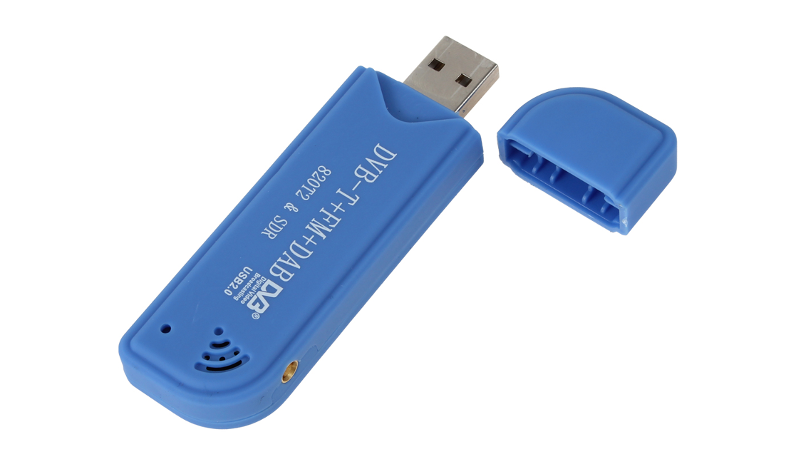
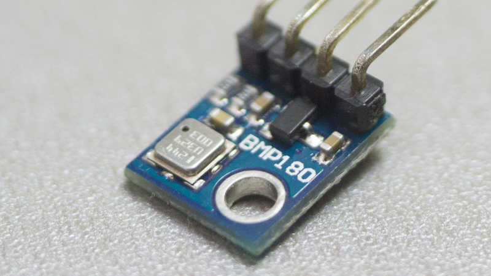

# Opcional
##Hub USB auto-alimentado

Si estás conectando dispositivos que usan más corriente de la que la Raspberry puede servir, necesitas un Hub o concentrador USB auto-alimentado.

Lo ideal es usar un Hub alimentado a 5V así podrás usar la misma fuente con la que alimentas la Raspberry.

####Compra un Hub USB comprobado.
Barato Hub USB 2.0 alimentado a 5V.

http://www.sailoog.com/shop-category/openplotter

##Dispositivo WiFi USB

Si quieres conectarte a Internet o conectar tus dispositivos móviles a OpenPlotter (punto de acceso) necesitarás un dispositivo WiFi USB.

Este dispositivo probablemente necesitará bastante corriente, especialmente si hay una gran distancia entre equipos o se están transfiriendo grandes volúmenes de datos. Debido a esto, posiblemente necesitarás conectar el dispositivo WiFi a un Hub USB auto-alimentado.

####Punto de acceso WiFi

Para compartir datos con otros equipos de abordo vía WiFi o usar un escritorio remoto, tienes que configurar OpenPlotter como punto de acceso y conectar estos equipos al mismo. Sin embargo no todos los dispositivos WiFi USB pueden funcionar como punto de acceso, solo los dispositivos con el chipset **RT5370**, **RTL8188CU/CUS**  o **RTL8192CU/CUS** funcionarán sin problemas en la Raspberry (OpenPlotter RPI v0.5.0 además soporta **RTL8192EU**). Recomendamos el **RTL8192CU/CUS**.

####Compra un Dispositivo WiFi USB comprobado.
300mbps, RTL8192CU chipset.

http://www.sailoog.com/shop-category/openplotter

##Dispositivo GPS USB

Si no dispones de GPS a bordo o quieres tener un GPS de respeto, esta es la forma más barata y eficaz.

Conectando un GPS a OpenPlotter conseguiremos datos precisos de posicionamiento; fecha y hora; velocidad y rumbo sobre el fondo.

####Compra un dispositivo GPS/GLONASS USB comprobado.

Bajo consumo, compatible GPS (americano) y GLONASS (ruso), salida NMEA-0183.

http://www.sailoog.com/shop-category/openplotter

##Conversor USB-NMEA 0183

Si dispones de sensores y electrónica a bordo con salidas NMEA-0183 (corredera, viento, rumbo...), necesitarás un conversor USB para conectarlos a OpenPlotter. Además podrás comunicarte con los equipos que dispongan de entradas NMEA-0183 (piloto automático).

El estandar NMEA-0183 utiliza conexiones RS422 pero puedes encontrar también conexiones RS232.

####Compra un conversor USB-NMEA 0183 bi-direccional comprobado.

Selecciona la conexión adecuada.

http://www.sailoog.com/shop-category/openplotter

##Receptor TDT USB (recepción AIS)

Los receptores TDT basados en el chip RTL2832U pueden ser usados como baratos receptores AIS de un solo canal.

Este dispositivo necesitará bastante corriente así que tendrás que conectarlo a un Hub USB auto-alimentado.

####Antena

Cualquier antena VHF funcionará correctamente. Algunas antenas caseras:

http://sdrformariners.blogspot.com.es/p/blog-page.html

http://nmearouter.com/docs/ais/aerial.html

https://www.youtube.com/watch?v=SdEglNHyHB4

####Compra un receptor TDT USB comprobado.

Con el chipset RTL2832U+R820T2.

http://www.sailoog.com/shop-category/openplotter

##Sensor IMU

Si no dispones de un compás electrónico a bordo necesitarás un IMU.

Un Inertial Measurement Unit (IMU) mide velocidad, orientación y fuerza gravitacional usando la combinación de un acelerómetro, un giroscopio y un magnetómetro.

Conectando un IMU obtendrás valores de rumbo magnético que a su vez es necesario para calcular otros factores como rumbo verdadero y viento real.

####IMUs compatibles

* Chip simple IMU, InvenSense MPU-9150.
* Magnetometro, Invensense MPU-6050 PLUS HMC5883, en bus auxiliar de MPU-6050's (manejado por el driver del MPU-9150).
* Giroscopos y acelerometros, InvenSense MPU-6050. Tomada como MPU-9150 sin magnetometros.
* Chip simple IMU (I2C y spi), InvenSense MPU-9250.
* Chip simple IMU, STM LSM9DS0.
* Chip simple IMU, STM LSM9DS1.
* L3GD20H + LSM303D (optionalmente con la LPS25H) tal como se utiliza en el Pololu AltIMU-10 v4.
* L3GD20 + LSM303DLHC tal como se utiliza en el IMU Adafruit 9-dof (version antigua con giroscopo GD20).
* L3GD20H + LSM303DLHC (opcionalmente con BMP180) tal como se usa en el nuevo IMU Adafruit 10-dof.
* Bosch BMX055 (aunque el soporte para magnetometro es actualmente experimental).
* Bosch BNO055 IMU with onchip fusion. Note: will not work reliably with RaspberryPi/Pi2 due to clock-stretching issues.

* InvenSense MPU-9150 IMU solo chip.
* InvenSense MPU-6050 plus HMC5883 magnetómetro en bus auxiliar de MPU-6050 (manejado por el conductor-MPU 9150).
* InvenSense MPU-6050 giroscopios + acclerometers. Tratada como MPU-9150 sin magnetómetros.
* InvenSense MPU-9250 solo IMU chip (I2C y SPI).
* STM LSM9DS0 sola IMU chip.
* STM LSM9DS1 sola IMU chip.
* L3GD20H + LSM303D (opcionalmente con la LPS25H) tal como se utiliza en la Pololu AltIMU-10 v4.
* L3GD20 + LSM303DLHC tal como se utiliza en la Adafruit 9-someras (versión anterior con GD20 giroscopio) IMU.
* L3GD20H + LSM303DLHC (opcionalmente con BMP180) tal como se utiliza en el nuevo Adafruit IMU 10 DOF.
* Bosch BMX055 (aunque el apoyo magnetómetro es experimental en la actualidad).
* Bosch BNO055 IMU con OnChip fusión. Nota: no va a funcionar de forma fiable con RaspberryPi / Pi2 debido a problemas de reloj-estiramiento

##Sensor de presión/temperatura

A menudo los sensores de presión y temperatura vienen juntos en la misma placa. Podrás almacenar estos valores y construir gráficas para monitorizar sus variaciones en el tiempo.

####Sensores de presión/temperatura compatibles

* BMP180
* LPS25H
* MS5611
* MS5637
