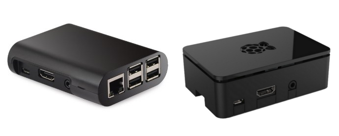
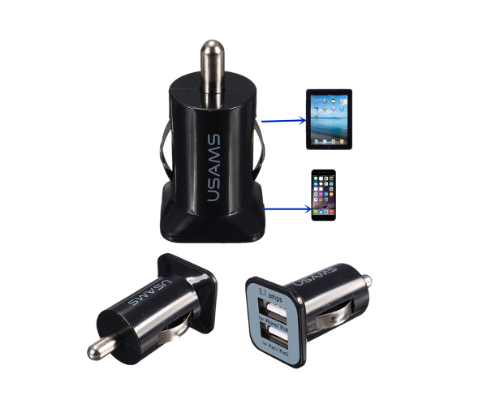
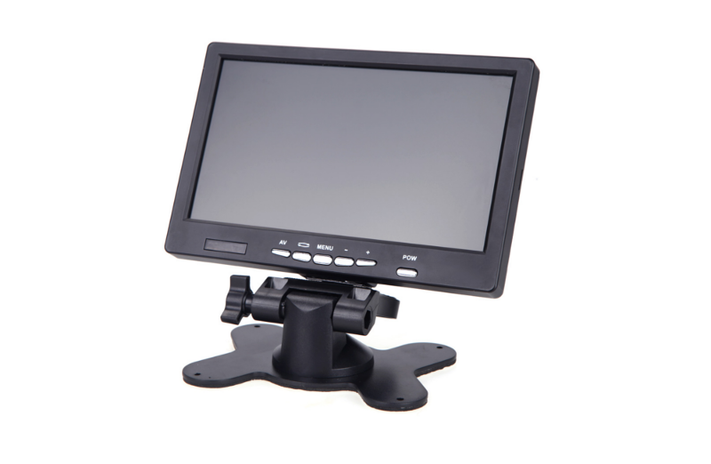
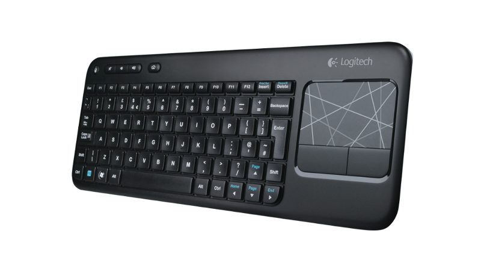
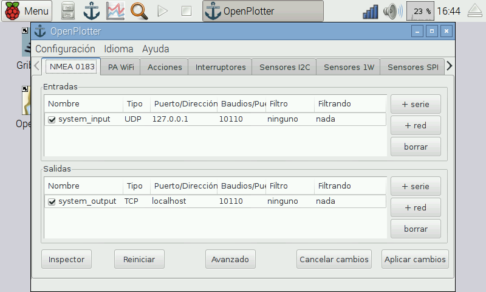

# Requerido

##Ordenador embebido ARM

En estos momentos recomendamos la popular [Raspberry Pi 2 Model B](https://www.raspberrypi.org/products/raspberry-pi-2-model-b/) porque reúne los requisitos: bajo coste, bajo consumo y tiene una enorme comunidad de desarrolladores.

¡**OpenPlotter RPI**,  el sistema operativo para Raspberry Pi y OpenPlotter está listo!

##Caja

Existen un montón de modelos para proteger la placa Raspberry Pi.
**Estamos trabajando en una caja resistente al agua.**

##Fuente de alimentación y cableado

La Raspberry se alimenta con una fuente de 5V mediante un conector micro USB (como la mayoría de cargadores de teléfono móvil estándar). La corriente que necesite (mA) dependerá de lo que conectemos a la placa. Para su funcionamiento interno puede llegar a consumir hasta 500mA y el máximo que puede gestionar vía USB son 1000mA por lo que necesitaremos como mínimo un cargador capaz de servir entre 1,5A y 2A. Si necesitamos conectar dispositivos USB que consuman más de 1A en total, tendremos que usar un Hub USB externo auto-alimentado.

Una buena opción podría ser un adaptador de coche (12v a 5V, 3.1A) con dos salidas por si necesitamos alimentar también un Hub USB.

##Monitor HDMI/DVI/VGA/TV y cableado

####HDMI

La Raspberry Pi tiene un puerto HDMI (video+audio) que puedes conectar a cualquier monitor o TV compatible con el cable correspondiente. Esta es la opción de más calidad y fácil ya que la mayoría de monitores y TV modernas tienen este tipo de conexión. También existen otras alternativas:

####DVI

Para monitores con entrada DVI, tendrás que usar un cable HDMI-DVI.

####VGA 

Pra monitores con entrada VGA, tendrás que usar un adaptador HDMI-VGA. Recomendamos usar solo adaptadores auto-alimentados.

####Video compuesto

Para TV analógicas tendremos que usar la salida de video/audio de 3.5mm de video compuesto de la Raspberry. Esta es la opción de menos calidad. También podremos usar esta salida de audio y la de video HDMI simultaneamente.

##Ratón y teclado

Cualquier teclado y ratón estándar funcionará en la Raspberry. Una buena opción son los teclados inalámbricos con touchpad integrado.

##Tarjeta SD

La Raspberry Pi debería funcionar con cualquier tarjeta micro-SD compatible. Hay que prestar atención a los siguientes aspectos:

####Tamaño de la tarjeta (capacidad) 

Se requiere un mínimo de 4GB pero se recomiendan 8GB.

####Clase de la tarjeta

La clase determina la velocidad constante de escritura de la tarjeta. Una tarjeta de clase 4 podrá escribir a 4MB/s, mientras que una de clase 10 debería poder mantener una velocidad de escritura de 10MB/s. Sin embargo esto no significa que una de clase 10 sea mejor que una de clase 4 para uso general ya que a menudo esta velocidad de escritura se consigue a costa de la velocidad de lectura y se aumentan los tiempos de búsqueda. La mejor tarjeta es la que mantiene un equilibrio entre las dos velocidades.

####Compra una tarjeta SD con OpenPlotter RPI pre-instalado

Tarjeta micro-SD de 8GB y clase 6 (con adaptador de tamaño) que supera a casi todas las tarjetas del mercado.

http://www.sailoog.com/shop-category/openplotter

##OpenPlotter RPI

####Descarga
http://www.sailoog.com/blog-categories/openplotter-download