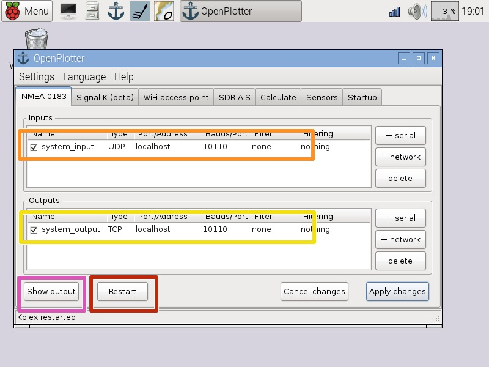
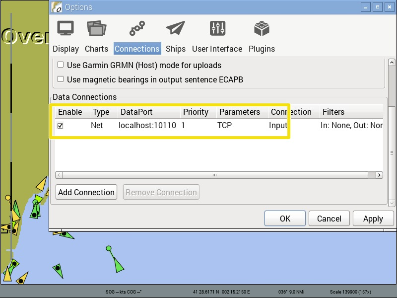

# Dispositivo DVB-T (AIS)

Los receptores de TDT USB basados en el chip Realtek RTL2832U y en el nuevo sintonizador R820T2, pueden funcionar como receptores AIS SDR. OpenPlotter viene preparado de serie para recibir AIS SDR, simplemente tienes que calibrar el receptor.

Este dispositivo necesitará más corriente de la que la Raspberry Pi le puede suministrar asi que tendrás que conectarlo a un Hub USB auto-alimentado.

Puedes comprar nuestro receptor TDT. Opcionalmente podemos calibrarlo por ti y añadir una nota con el valor de ganancia y de corrección (ppm):

http://www.sailoog.com/shop-category/openplotter

o puedes seguir esta guía detallada:

http://sailoog.dozuki.com/Guide/Connecting+and+calibrating+SDR-AIS+dongles/3

## Recibir

Una vez has encontrados tus valores de **ganancia** y de **corrección** (en rojo), selecciona **Activar generación NMEA AIS** (en rosa).

Si tienes tráfico AIS alrededor, los datos NMEA de AIS serán decodificados y enviados a la ** entrada UDP localhost 10110** (en naranja).

Si quieres tener acceso a los datos AIS tendrás que conectar tu software (OpenCPN) a la **salida TCP localhost 10110** (en amarillo).

Presiona **Reiniciar** (en rojo) para asegurarte de que el multiplexor está funcionando.

Presiona **Mostrar salida** (en rosa) para ver los datos AIS en el inspector NMEA.

Asegurate de que OpenCPN esté escuchando en **TCP localhost 10110** (en amarillo).

## Antena

Aunque puedes llegar a recibir algún barco con la mini antena suministrada, esta no es suficiente para la óptima recepción de las frecuencias AIS. Cualquier antena VHF con el adaptador de conexión adecuado funcionará correctamente. El tipo de conexión de antena del dispositivo es MCX hembra.

Algunas antenas para auto-construcción:

http://sdrformariners.blogspot.com.es/p/blog-page.html

http://nmearouter.com/docs/ais/aerial.html

https://www.youtube.com/watch?v=SdEglNHyHB4