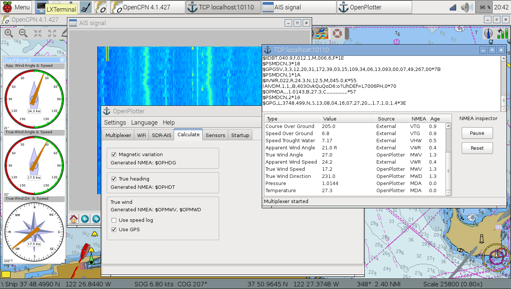

# Qu'est-ce qu'OpenPlotter?
---

**This chapter needs to be written/updated/translated**: http://forum.openmarine.net/forumdisplay.php?fid=16

---

Certains achètent des bateaux quand d'autres les construisent. Pourquoi ne pas construire votre propre électronique ?
OpenPlotter est une combinaison de logiciels et de matériels utilisable comme aide à la navigation sur les petites et moyennes embarcations. C'est aussi une solution complète de domotique à destination de votre bateau. 

OpenPlotter fonctionne sur les ordinateurs a processeur ARM tel que le [Raspberry Pi](https://www.raspberrypi.org/) et est open-source, low-cost et consommant très peu. Sa conception est modulaire, vous pouvez donc n'installer et n'utiliser que ce qui vous est utile. 

**Faites-le vous-même !**

## Fonctionnalités

* **Traceur de cartes**. Grâce à  [OpenCPN](http://opencpn.org), logiciel de navigation Open Source réputé et ses nombreux plugins.
* **Prévisions météo**. Téléchargez et visualisez les fichiers Grib avec [zyGrib](http://www.zygrib.org).
* **Multiplexeur NMEA 0183**. Multiplexez et filtrez les données en provenance de sources réseau ou série illimitées. Envoyez ces données vers tout type de sortie.
* **Serveur Signal K (beta)**. OpenPlotter est prêt pour [Signal K](http://signalk.org/), le nouveau format gratuit, universel et open-source d'échange de données nautiques.
* **Moniteur NMEA**. Contrôlez les données échangées, diagnostiquez les éventuels conflits.
* **Point d'accès WiFi**. Partagez les données du bord (NMEA 0183, Signal K, bureau à distance, connexion internet) avec vos ordinateurs portables, smartphones, tablettes. Si une connexion internet est disponible, OpenPlotter pourra être votre point d'accès WIFI.
* **Ecran à distance**. Accédez à OpenPlotter de votre cockpit sur vos terminaux mobiles.
* **Headless**. Démarrage facile sans écran.
* **Réception SDR-AIS**. Recevez, décodez et affichez les cibles AIS avec une clé DVD-T USB. Outils de calibration inclus.
* **Compas magnétique et clinomètre**.  Ajoutez aux données du bord le cap magnétique et l'angle de gite avec un capteur IMU (Inertial Mesurement Unit). Compensation de la gite, outils de calibration inclus.
* **Baromètre, Thermomètre and Hygromètre**. Enregistrez l'historique de la pression atmosphérique, de la température et de l'humidité de l'air et affichez ces données pour analyse des tendances météo.
* **Capteurs de température multiples**. Placez des capteurs multiples pour récupérer et afficher les valeurs de température de l'eau, du moteur, du frigo, etc...
* **Capteurs spéciaux**. Détectez les mouvements, l'ouverture d'une porte ou d'un hublot, le niveau de remplissage d'un réservoir, etc...
* **Déclinaison magnétique**. Calcul de la déclinaison magnétique en fonction de votre position et de la date.
* **Cap vrai**. Calcul du cap vrai à partir du cap magnétique et de la déclinaison.
* **Vent vrai**. Déduit le vent vrai des valeurs du vent apparent et de la vitesse du bateau (Loch/speedo ou GPS).
* **Taux de virage**. Calcule la vitesse de virage de l'embarcation.
* **Monitoring à distance**. Envoyez les informations de votre choix via Twitter ou par email.
* **Actions pré-programmées**. Déclenchez des actions pré-définies (alarme, envoi d'un tweet, ...) en fonction des variations d'une ou plusieurs données choisies (température, vitesse du vent, changement de cap, ...)
* **Interrupteurs customs**. Connect external switches and link them with actions.
* Connectez un ou plusieurs interrupteurs pour interagir avec Openplotter (Reboot, déclenchement d'action, ...)
* **Composants additionnels**. Relais, LEDs, buzzers ...
* **Outils de mise à l'heure**. Définissez facilement l'heure du système et le fuseau horaire à partir des données NMEA.
* **Gestion des logiciels au démarrage**. Sélectionnez simplement les logiciels à lancer automatiquement au démarrage du système.

