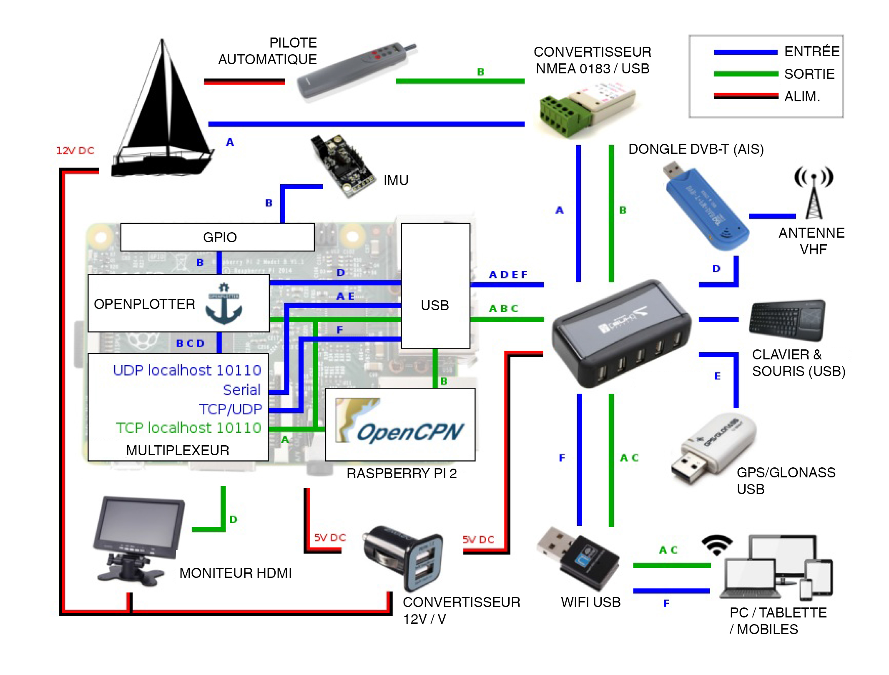

#COMMENT ÇA MARCHE ?

OpenPlotter acquiert les données à partir de plusieurs sources :

- Capteurs sur GPIO

- Liaison série via USB

- Tout ordinateur ou périphérique connecté au même réseau.

Certaines de ces sources envoient les trames NMEA directement et d'autres, comme l'AIS SDR ou l'IMU, doivent être traitées par openplotter pour être converties en NMEA.

Toutes ces sources sont combinées en un seul flux NMEA envoyé vers:

- OpenCpn pour afficher votre position, les données de vent, de cap, etc...

- D'autres appareils connectés en WIFI ou via un port série.

- Vers OpenPlotter lui-même pour la génération de trames NMEA supplémentaires.

**ENTREES (en bleu)**

A : Données NMEA en provenance de vos équipement existants (GPS, girouette, sondeur, etc...).

B : Données brutes de l'IMU, converties en phrases NMEA et distribuées sur un port UDP (localhost:10110) par OpenPlotter. Si les capteurs de température/pression sont disponibles, leurs données  seront egalement gérées par OpenPlotter.

C : Si Openplotter dispose des données nécessaires, il pourra calculera les phrases NMEA de la variation magnétique, du cap vrai et du vent vrai. Ces nouvelles trames seront envoyées au mème port UDP.

D : Le signal AIS du dongle DVB-T est décodé par OpenPlotter. Le NMEA généré est envoyé au port UDP localhost:10110.

E : Si vous avez un GPS USB, vous définirez une entrée série dans OpenPlotter.

F : Vous pouvez recevoir les données NMEA d'un autre appareil par le WIFI. Pour cela, vous définirez une entrée TCP/UDP avec OpenPlotter.

**SORTIES (En vert)**

A : Flux NMEA multiplexé. Toute donnée collectée sur la sortie TCP localhost:10110. Ce flux est envoyé à OpenCpn, aux périphériques externes et à OpenPlotter pour calculs.

B : Commandes au pilote automatique. Vous aurez a définir une sortie série en filtrant les trames spécifiques au pilote auto.
!!!!!!!!!!!!!!  exemples de trames !!!!!!!!!!!!!

C : Bureau à distance / Ecran(s) déporté(s).

D : Sorties vidéo et audio sur port HDMI. Comme expliqué plus haut, d'autres sorties sont à votre disposition pour ces types de signaux.

