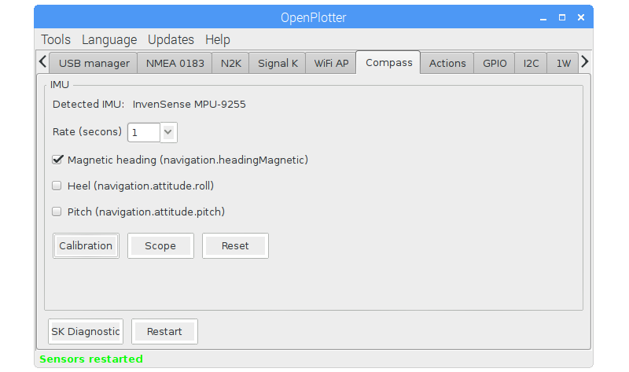
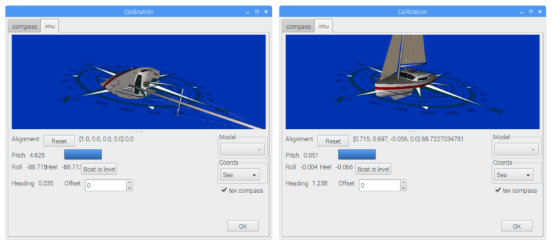
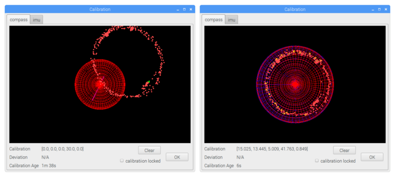

# Compass

Installez l'IMU à bord, à sa position définitive, éloigné des possibles sources d'interférences comme les éléments métalliques, ou les hauts parleurs. Après l'avoir connecté, il devrait être détecté dans l'onglet _Compass_.

Activez la réception d'une au moins des trois magnétudes possibles et cliquez _Calibration_.

Dans un port, amarré et le plus horizontal possible, sélectionner l'onglet _imu_ et cliquer sur _Boat is level_. Quelques secondes plus tard le bateau 3D devrait être de niveau.

Ne fermer pas la fenêtre Calibration, sélectionner l'onglet _compass_ et naviguer normallement. Le système recevra des données de l'IMU pendant 2 minutes et si il y a plus de 60° de variation de cap et que les données reçues sont valides, l'IMU sera calibré. Une sphère bleue devrait apparaître et le nuages de points correspondre à la sphère rouge.

Le système se re-calibrera toutes les 2 minutes si l'une des magnétudes de l'IMU est activée et si suffisament de données valides ont été reçues. Toutes les 10 minutes la calibration et le niveau sont enregistré pour être utilisés dans les sessions ultérieures.
