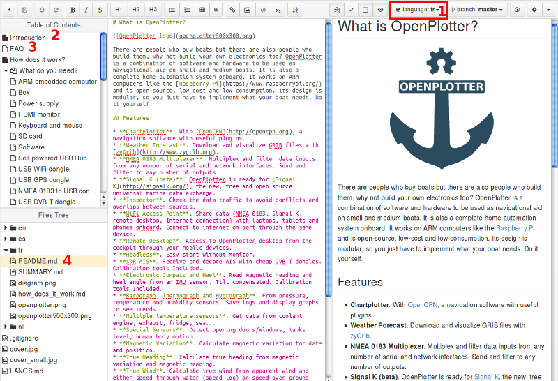

# Documentation

* Créez un compte Github: [github.com/join](https://github.com/join)
* Envoyez votre nom d'utilisateur Github à [www.sailoog.com/contact](http://www.sailoog.com/contact) et attendez la confirmation d'autorisation.
* Une fois vos droits confirmés, connectez-vous à **Gitbook** avec votre login/pass Github.
* Allez sur: [www.gitbook.com/book/sailoog/openplotter-documentation](https://www.gitbook.com/book/sailoog/openplotter-documentation) et cliquez sur le bouton (en haut à droite).

## Writing

We write the documentation source in English to make easier translating to other languages. If you want to
write a chapter, please notify to [www.sailoog.com/contact](http://www.sailoog.com/contact) for coordination. Please do not modify the index or write a chapter without notifying. 

Once the new chapter is done in English, please copy the new text to the rest
of languages to be ready to translate. If you are not creating a new chapter but editing an existing one,
include a note at the beginning of the rest of languages “This translation needs to be updated”.

To include images in the rest of languages from English folder, the path is ```../en/xxx.png```

If you want to add images of wiring and connections consider using [fritzing](http://fritzing.org) application.

## Translating



1. Select the language you want to edit.
2. Chapters in black are ready to be translated. You can translate chapters titles too.
3. Do not edit chapters in white.
4. Do not modify files names (xxx.md xxx.png xxx.jpg ...) because they are referenced in the text.