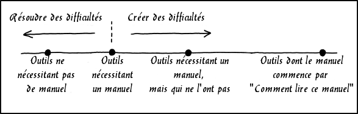

# Documentation

_Auteur: Randall Munroe[[1]](https://xkcd.com), license CC BY-NC 2.5._

Nous stockons la documentation de OpenPlotter sur Github[[2]](https://github.com/sailoog/openplotter-documentation). Ce stockage est lié à un livre Gitbook [[3]](https://www.gitbook.com/book/sailoog/openplotter-documentation/details) et nous coordonnons les acteurs via un forum[[4]](http://forum.openmarine.net/forumdisplay.php?fid=16) sur OpenMarine.

Si vous voulez nous aider à écrire, mettre à jour, corriger ou traduire vous avez deux options.

Vous êtes familier avec **Github** et **Gitbook** édition dépôts 

* Créez un compte **Github**[[5]](https://github.com/join)
* Envoyez votre nom d’utilisateur **Github** sur le forum[[4]](http://forum.openmarine.net/forumdisplay.php?fid=16) et attendez que l’habilitation d’éditer le dépôt vous soit attribuée par un administrateur.
*	Dans le thread des statuts des chapitres du forum[[4]](http://forum.openmarine.net/forumdisplay.php?fid=16), sélectionnez un chapitre de couleur bleue et annoncez vos intentions dans un nouveau thread.
* Une fois que vous avez l’habilitation, loggez-vous à **Gitbook**[[6]](https://www.gitbook.com/login) avec votre compte Github.
* Accédez au livre[[3]](https://www.gitbook.com/book/sailoog/openplotter-documentation/details) et cliquez sur le bouton  _Edit_ en haut à droite.

Vous n’êtes pas familier avec **Github** et **Gitbook** édition dépôts :

*	Dans le thread des statuts des chapitres du forum[[4]](http://forum.openmarine.net/forumdisplay.php?fid=16), sélectionnez un chapitre de couleur bleue et annoncez vos intentions dans un nouveau thread.
* Quand vous avez fini, publiez le texte et les images dans un nouveau thread sur le forum [[4]](http://forum.openmarine.net/forumdisplay.php?fid=16) et quelqu’un éditera le livre pour vous.

## Ecriture

Nous écrivons la documentation source en Anglais, pour faciliter la traduction vers d’autres langues.

Merci de ne pas modifier l’index ou la structure sans consulter les développeurs. Une fois un chapitre achevé, merci de le signaler sur le forum[[4]](http://forum.openmarine.net/forumdisplay.php?fid=16) pour qu’il soit marqué en vert.

Pour inclure des images dans une langue autre que l’Anglais, depuis le dossier de l’Anglais, le chemin est : `../en/xxx.png`

Si vous voulez ajouter des images de câblages ou de connexions utilisez l’application fritzing[[7]](http://fritzing.org).

Ne modifiez ni ne traduisez les noms de fichiers (xxx.md xxx.png xxx.jpg ...) car ils sont référencés dans le texte.

---

[1] https://xkcd.com [2] https://github.com/sailoog/openplotter-documentation [3] https://www.gitbook.com/book/sailoog/openplotter-documentation/details [4] http://forum.openmarine.net/forumdisplay.php?fid=16 [5] https://github.com/join [6] https://www.gitbook.com/login [7] http://fritzing.org

