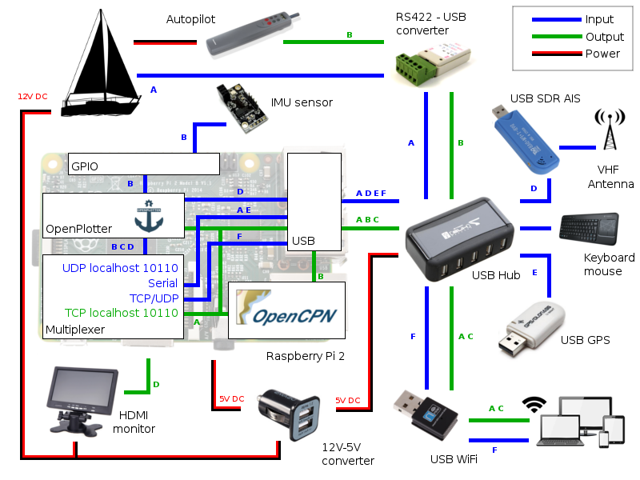

# Comment ça marche ??

---

**This chapter needs to be written/updated/translated**

http://forum.openmarine.net/forumdisplay.php?fid=16

---

OpenPlotter peut recevoir les données de différentes sources:

* Capteurs et appareils connectés au GPIO
* Appareils reliés au port USB
* Tout ordinateur ou appareil portable connecté au même réseau.

La plupart de ces sources envoient directement leurs données au format NMEA0183. D'autres données, l'AIS SDR par exemple, doivent être traitées et converties par OpenPlotter. Enfin, il existe des sources qui n'utilisent pas le NMEA.

Toutes les informations de ces sources sont combinées (multiplexées) en un seul flux de données qui peuvent être envoyées à:

* Un traceur de cartes en local (OpenCPN).
* Un calculateur NMEA qui générera de nouvelles données (ex: vent vrai)
* Des détections / actions pré-définies*
* D'autres appareils via une connexion réseau, WIFI ou série.
* Un afficheur de données.
* Un écran d'instruments virtuels
* Un compte Twitter.
* Un compte email.

Les chapitres qui suivent vous indiquent comment faire tout cela !

