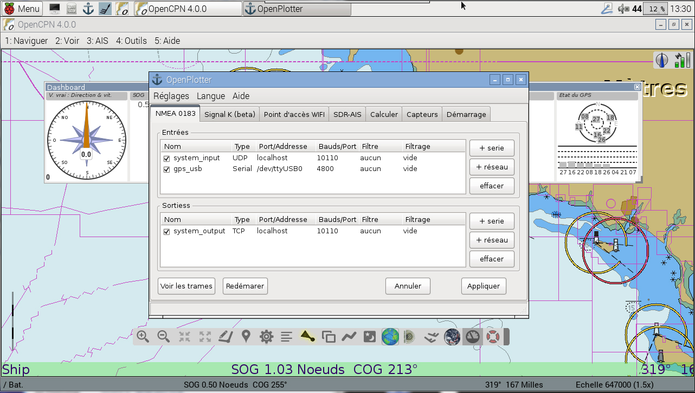

###LES INDISPENSABLES

---

**ORDINATEUR A PROCESSEUR ARM**

---

 

Nous recommandons le célèbre RASPBERRY PI 2 car il remplit parfaitement le cahier des charges: peu cher, basse consommation, bénéficiant d'une énorme communauté de développeurs. 

---

**BOÎTIER DE PROTECTION**

---

Vous trouverez sur internet un grand nombre de boîtiers pour protéger votre Raspberry PI2. Nous travaillons à la conception d'un boîtier étanche.

---

**ALIMENTATION & CÂBLE**

---

Le Raspberry Pi est alimenté en 5V par un connecteur USB comme on en trouve pour la plupart des smartphones récents. Les besoins précis en courant (mA) du Raspberry Pi dépendent de ce que vous lui ajouterez, avec un maximum de 1A en sortie. 

Si vos périphériques USB demandent une puissance supérieure à 1A vous devrez brancher ces périphériques sur un hub USB disposant de sa propre alimentation.

Il peut être judicieux de vous procurer un adaptateur USB pour voiture (allume-cigare, 12V à 5V, 3.1A) disposant de 2 sorties pour alimenter le hub USB.

---

**MONITEUR & CÂBLE HDMI/DVI/VGA/TV**

---

- HDMI

Le Raspberry Pi dispose d'un port HDMI pour un branchement direct sur un moniteur ou un téléviseur HDMI avec le câble correspondant. C'est la solution la plus simple, mais il en existe d'autres:

- DVI

Pour les moniteurs ne disposant que d'un port DVI, il est possible d'utiliser un câble de conversion HDMI/DVI.

- VGA

Pour les moniteurs équipés d'un port VGA en entrée, vous devrez vous procurer un adaptateur HDMI-VGA. Nous vous suggérons de n'utiliser que des adaptateurs avec alimentation externe.

- COMPOSITE

Pour les écrans à entrée analogique vous utiliserez un cable jack 3.5mm/RCA. Ce type de connexion est fréquent pour les petits moniteurs LCD de type "caméra de recul", fonctionnant en 12V.

---

**CLAVIER & SOURIS**

---

Tout clavier et souris USB fonctionnera avec votre Raspberry Pi. Certains modèles sans fils pourront aussi être utilisés (sous réserve de compatibilité).

---

**CARTE SD**

---

Toute carte compatible micro-SD fonctionnera avec le Raspberry Pi 2. Pour une utilisation sans problèmes, certaines préconisations doivent cependant guider votre choix :

- CAPACITÉ

Un minimum de 4Go est suffisant, 8Go sont recommandés.

- CLASSE

La classe de la carte SD détermine la vitesse d’écriture des données. Une carte de classe 4 pourra écrire à 4MB/s, une carte de classe 10 pourra atteindre 10MB/s. 

Il faut cependant noter que dans le cadre d’une utilisation « générale » les 2 classes pourront avoir des performances équivalentes: le gain en vitesse d'écriture est souvent obtenu au détriment de la vitesse de lecture et des temps de recherche.

**OBTENIR UNE CARTE SD AVEC OPENPLOTTER RPI PRÉ-INSTALLÉ:**

Notre boutique en ligne vous propose une carte SD avec OpenPlotter RPI pré-installé.
Rendez-vous à l’adresse http://www.sailoog.com/shop 

---

**OPENPLOTTER RPI**

---

OpenPlotter RPI est une distribution pour Raspberry Pi disponible dès maintenant sous forme d'image pour carte SD. C'est une version adaptée de RASPBIAN, le système d’exploitation officiel du Raspberry Pi.

- TÉLÉCHARGEMENT:

http://www.sailoog.com/en/blog-categories/openplotter-rpi

