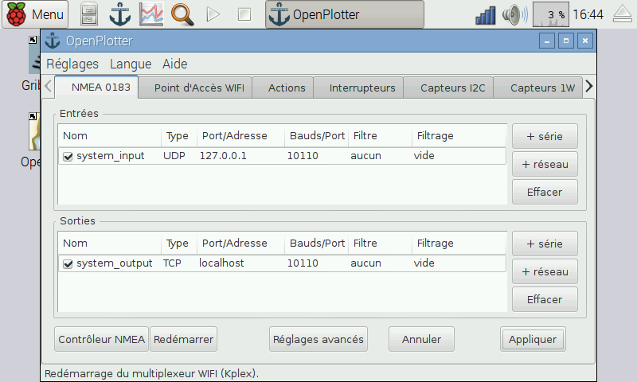

# Software

**OpenPlotter RPI** est une version modifiée de [Raspbian](https://www.raspbian.org/), le système d'exploitation officiel pour Raspberry Pi. Il contient tout ce dont vous avez besoin. 

OpenPlotter RPI est open-source et gratuit. Téléchargez-le et suivez les instructions:

http://www.sailoog.com/en/blog-categories/openplotter-rpi

or commandez une carte SD pré-installée:

---

**Buy an 8GB SD card with OpenPlotter RPI ready to run.**

http://www.sailoog.com/shop-category/openplotter

---