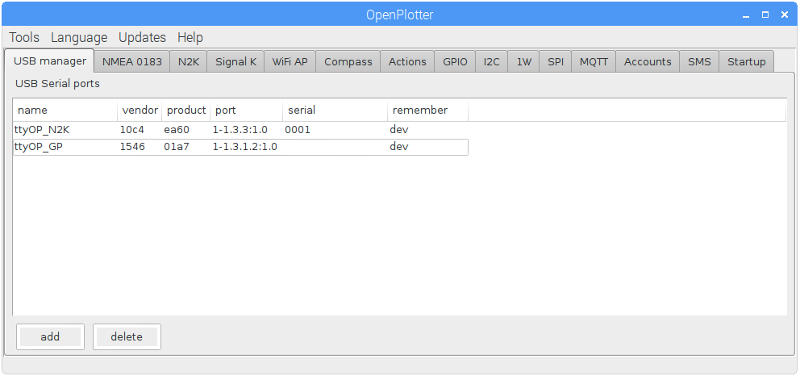

# OpenPlotter Tabs

---

**This chapter needs to be written/updated/translated**

http://forum.openmarine.net/forumdisplay.php?fid=16

---

Most of the core features of OpenPlotter can be configured from controls located on tabs.

