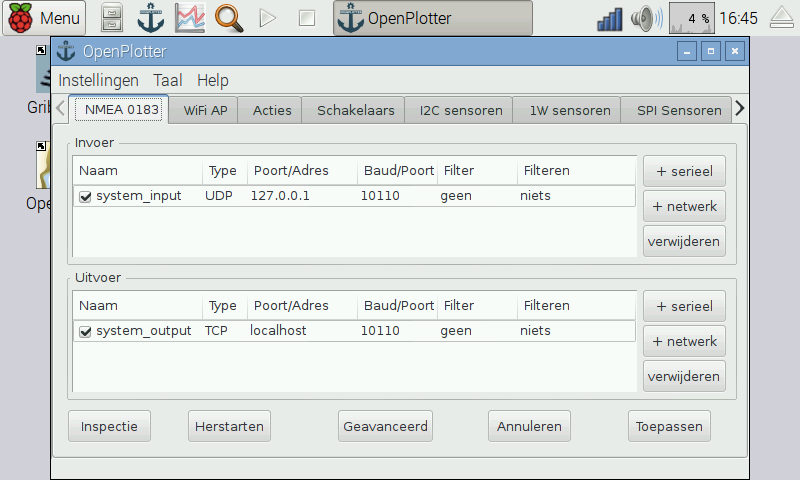

# Software

**OpenPlotter RPI** is a modified version of [Raspbian](https://www.raspbian.org/), the official operating system for the Raspberry Pi. It contains all you need.

OpenPlotter RPI is open-source and free. Download and follow the instructions:

http://www.sailoog.com/en/blog-categories/openplotter-rpi

or buy our plug and play SD card with OpenPlotter RPI:

---

**Buy an 8GB SD card with OpenPlotter RPI ready to run.**

http://www.sailoog.com/shop-category/openplotter

---